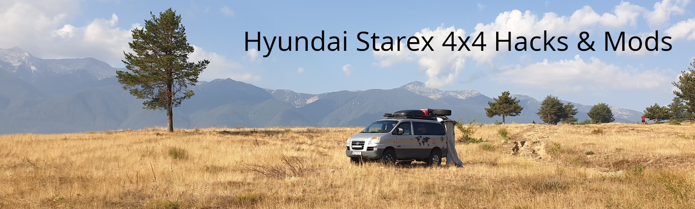
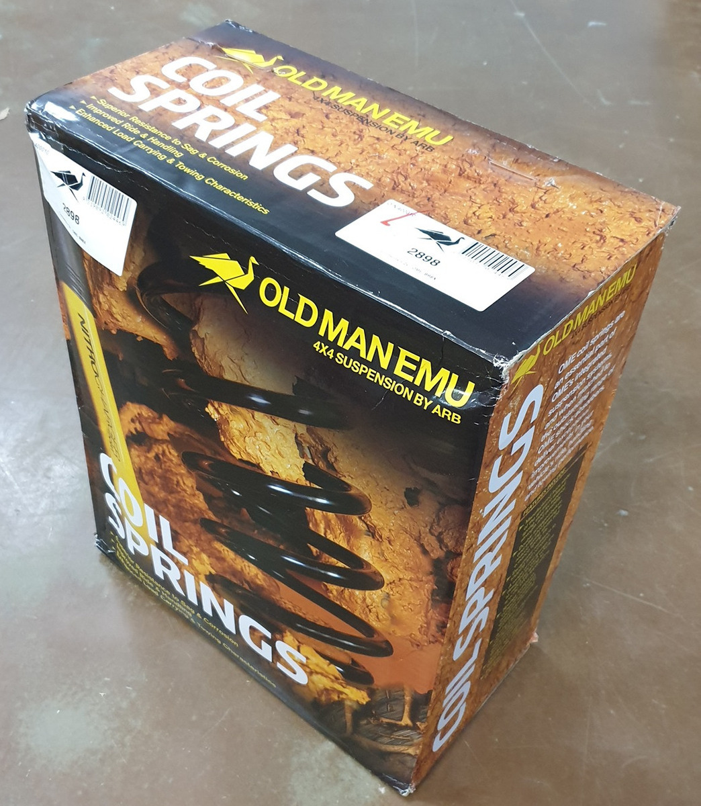

Modyfikacje, tuning, mechanika, wyprawy, offroad - Hyundai H-1 Starex 4x4

---

## 🛠️ [Mechanika & Tuning](https://github.com/klapek/starex4x4/tree/main/tuning)

### [Lift zawieszenia +2" (OME 2898)](./tuning/lift-2-cale.md)

*Zastosowanie sprężyn od Toyoty Land Cruiser J15. Idealne rozwiązanie Plug&Play dla dociążonego tyłu (zabudowa, sprzęt).*

---

## 🚐 [Wyprawy & Offroad](https://github.com/klapek/starex4x4/tree/main/wyprawy)

---

.
