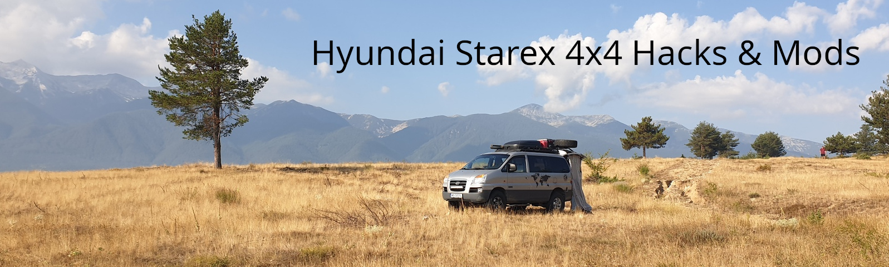

Modyfikacje, tuning, mechanika, wyprawy, offroad - Hyundai H-1 Starex 4x4

---

## 🛠️ [Mechanika & Tuning](https://github.com/klapek/starex4x4/tree/main/tuning)

* **[Remont blacharski i walka z rdzą](./tuning/ruda.md)**  
 *Fotorelacja z 1,5-rocznej odbudowy podwozia, progów (pod Hi-Lift) i nadkoli.*

* **[Opony 31" - Montaż i modyfikacje nadkoli](./tuning/31.md)**   
*Jak zmieścić 31x10.5R15: fotorelacja z cięcia zderzaka i progów oraz pomiary wysokości.*

* **[Komputer pokładowy TurboGauge (OBD)](./tuning/turbogauge.md)**  
 *Monitoring parametrów silnika na żywo: temperatura wody, ładowanie, obroty i inne.* 

* **[Stalowa osłona silnika Kolchuga](./tuning/oslona.md)**  
 *Pancerna ochrona miski olejowej (ZiPoFlex) z uwagami dotyczącymi montażu w Starexie.*  

* **[Sakwy w przednich drzwiach (organizery)](./tuning/sakwa.md)**  
*Tani i skuteczny sposób na zagospodarowanie wnęki stopnia przy przednich drzwiach.*  

* **[Drugi akumulator + separator T-Max](./tuning/2aku.md)**  
  *Niezależne zasilanie hotelowe (95Ah) z inteligentnym ładowaniem i podglądem napięcia.*  

* **[Woda w kabinie? Naprawa odpływu klimatyzacji](./tuning/wyciek-klimatyzacji.md)**  
  *Prosty hack na suchą podłogę – brakująca gumowa rurka.*

* **[Lift zawieszenia +2" (OME 2898)](./tuning/lift-2-cale.md)**  
*Zastosowanie sprężyn od Toyoty Land Cruiser J15. Idealne rozwiązanie Plug&Play dla dociążonego tyłu (zabudowa, sprzęt).*

---

## 🗺️ [Wyprawy & Offroad](https://github.com/klapek/starex4x4/tree/main/wyprawy)

* **[Uchwyt koła zapasowego i akcesoriów na klapę](./wyprawa/uchwyt-kolo.md)**   
*Stelaż na koło 31" i walizkę: montaż do zawiasów oraz dobór wzmocnionych amortyzatorów HAHN.*

* **[Zabudowa wyprawowa DIY v1.2 (Lodówka i spanie)](./wyprawa/zabudowa-diy-1.2.md)**   
*Rozbudowa o szufladę na lodówkę, spanie bez przekładania bagaży i bezpieczne miejsce dla psa.*

* **[Namiot na tylną klapę (System Flexline)](./wyprawa/namiot-klapa.md)**  
*Modyfikacja namiotu Reimo: montaż na elastycznej szynie, magnesy i zintegrowana torba.* 

* **[Dodatkowy zbiornik paliwa (60L)](./wyprawa/2bak.md)**   
*Zwiększenie zasięgu: montaż baku z Fiata Doblo II w miejsce koła zapasowego + osłona alu.* 

* **[Ogrzewanie postojowe Planar 2kW](./wyprawa/webasto.md)**   
*Ciepło w zimie i wentylacja w lecie. Montaż w nadkolu i poprawka rur pod opony 31".* 

* **[Obrotowa lampa LED (Wnętrze/Kuchnia)](./wyprawa/lampa-led.md)**  
  *Sprytne oświetlenie na obrotowym uchwycie – doświetla środek auta lub kuchnię pod klapą.*  

* **[Zabudowa wyprawowa DIY (Wersja 1.1)](./wyprawa/zabudowa-diy-1.1.md)**  
*Rozbudowa o system zasłonek by zwiększyć prywatność i komfort noclegów "na dziko"*

* **[Zabudowa wyprawowa DIY (Wersja 1)](./wyprawa/zabudowa-diy.md)**  
*Projekt krok po kroku zabudowy wyprawowej DIY. Spanie 160x200cm, konfiguracja 2+2 lub 2+1 z lodówką. Pełna dokumentacja foto i wymiary.*

---

## 📁 Dokumentacja & Bezpieczeństwo 

* **[Karta Ratunkowa Hyundai H1 / Starex - wersja zmodyfikowana (PDF)](./dok/karta_ratunkowa_h1-mod.pdf)**  
*Schemat dla służb ratowniczych: rozmieszczenie akumulatorów, zbiornika paliwa, napinaczy pasów i poduszek powietrznych. Zawiera następujące modyfikacje: 2 akumulator, 2 bak paliwa, hebel pod maską. Wydrukuj i umieść za osłoną przeciwsłoneczną kierowcy!*

* **[Karta Ratunkowa Hyundai H1 / Starex - wersja fabryczna (PDF)](./dok/karta_ratunkowa_h1.pdf)**   
*Schemat dla służb ratowniczych: rozmieszczenie akumulatorów, zbiornika paliwa, napinaczy pasów i poduszek powietrznych. Wydrukuj i umieść za osłoną przeciwsłoneczną kierowcy!*

---

## 🔗 [Baza przydatnych linków](./dok/linki.md)
*Wszystkie ważne miejsca w sieci: fora, kalkulatory, specyfikacje i narzędzia online w jednym miejscu.*  

---

## 📺 Archiwum Wideo 
*Lokalne kopie ważnych materiałów wideo:*

* **[Bezpieczniki: Lokalizacja i Opis](./video/bezpieczniki.md)**
* **[Crash Test: Archiwalne nagranie](./video/crash-test.md)**

---

