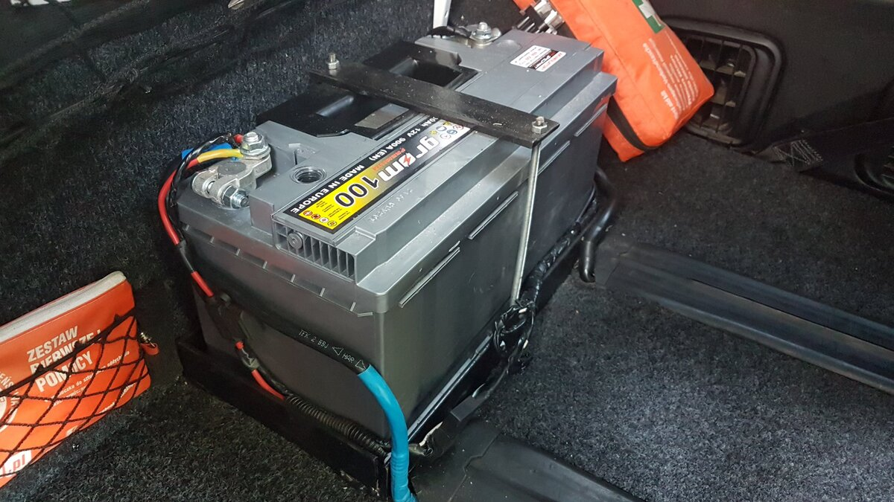
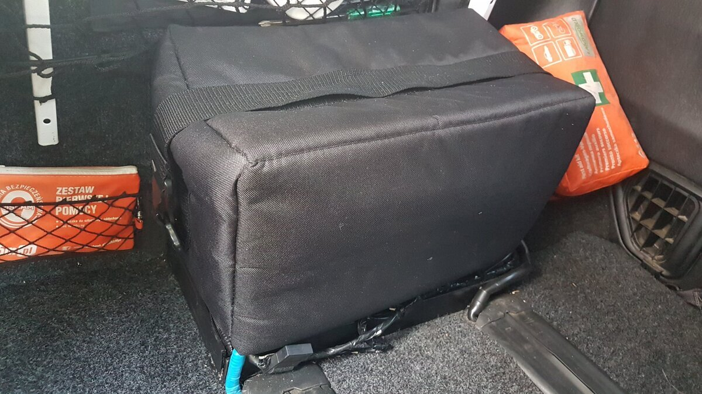
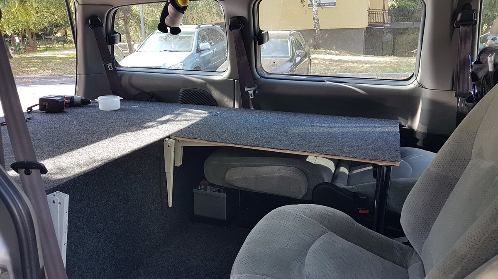
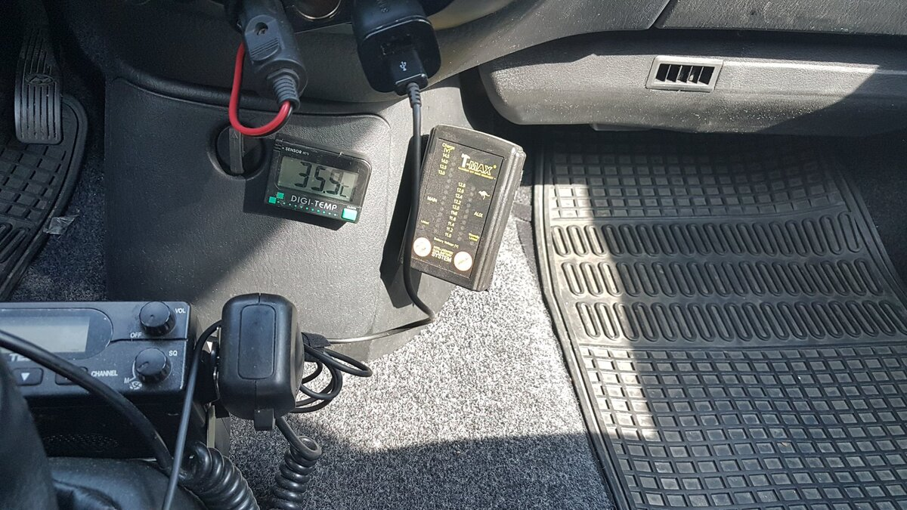
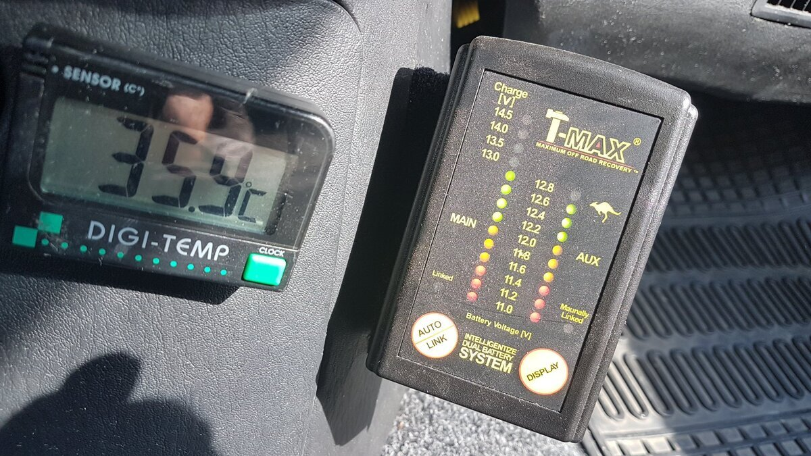
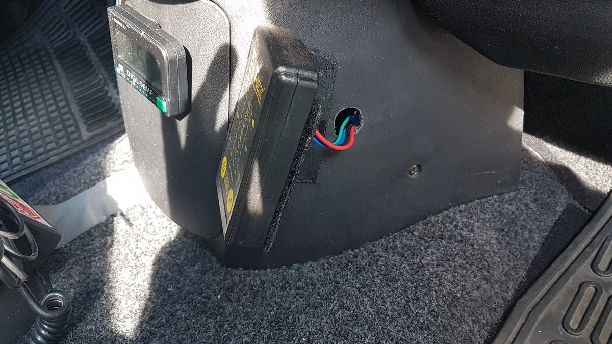

# Drugi akumulator i separator T-Max
# Dual Battery System with T-Max Isolator

---

## [PL] Opis modyfikacji
Instalacja drugiego akumulatora (hotelowego) o pojemności 95Ah, służącego do zasilania lodówki, oświetlenia i ładowania sprzętów. System zarządzany jest przez inteligentny separator T-Max.

### Kluczowe rozwiązania:
* **Montaż:** Akumulator zamontowany na solidnej metalowej podstawie przykręconej do podłogi tuż za szynami drugiego rzędu siedzeń.
* **Ergonomia:** Wybrana lokalizacja nie ogranicza funkcjonalności wnętrza – fotel można odsunąć do samego końca i w pełni rozłożyć oparcie (zarówno w trybie jazdy, jak i sypialnym).
* **Sterowanie:** Sterownik T-Max został ukryty pod obudową lewarka skrzyni biegów (zamiast pod maską), co chroni go przed warunkami atmosferycznymi. Sam panel sterowania zamocowany na rzep przy schowku.

---

## [EN] Modification Details
Installation of a secondary (leisure) 95Ah battery to power the fridge, lighting, and electronics. The system is managed by a T-Max dual battery isolator.

### Key features:
* **Mounting:** The battery is placed on a custom metal base bolted to the floor just behind the second-row seat rails.
* **Ergonomics:** The location allows for full seat movement and reclining, even in sleeping mode.
* **Control Unit:** The T-Max isolator is tucked away under the gear shifter console (instead of the engine bay), providing better protection. The control panel is mounted via Velcro near the storage compartment.

---

## 📸 Dokumentacja Foto / Photo Documentation

*PL: Podstawa metalowa za szynami 2. rzędu. Kabel sterujący idzie w szynie do schowka.*  
*EN: Metal base behind 2nd-row rails. Control cable hidden inside the seat rail.*

*PL: Standardowy kapturek na akumulatorze 95Ah.*  
*EN: Standard terminal cover on the 95Ah battery.*

*PL: Fotel mieści się nad akumulatorem nawet po maksymalnym rozłożeniu (tryb sypialny).*  
*EN: The seat easily clears the battery even when fully reclined (sleeping mode).*

*PL: Separator przykręcony do obudowy schowka. Sterownik ukryty pod lewarkiem biegów.*  
*EN: Isolator attached to the storage housing. Controller hidden under the gear shifter.*

*PL: Panel pokazuje stan naładowania obu akumulatorów.*  
*EN: The display shows the voltage levels for both batteries.*

*PL: Montaż na blaszce z rzepem samoprzylepnym – szybki demontaż w razie potrzeby.*  
*EN: Mounted on a metal plate with Velcro – easy to remove if needed.*

---
**Status:** System w pełni sprawny, zapewnia niezależność energetyczną na postoju.
