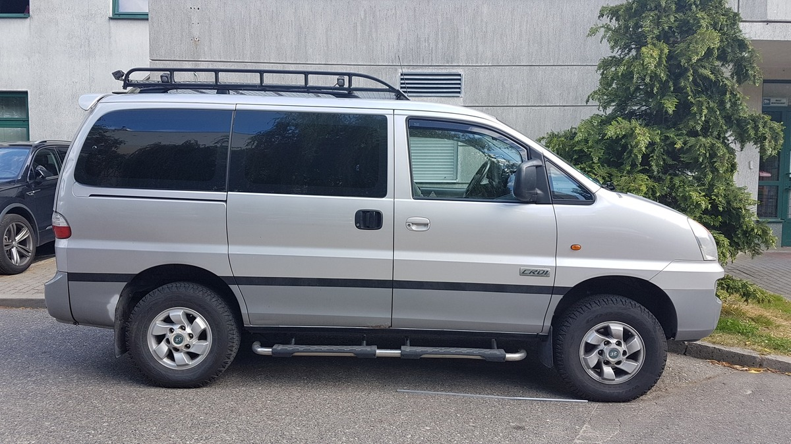
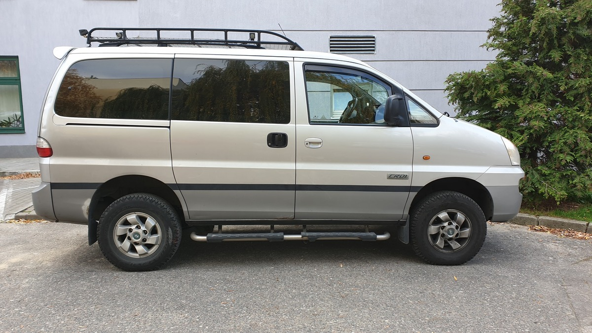
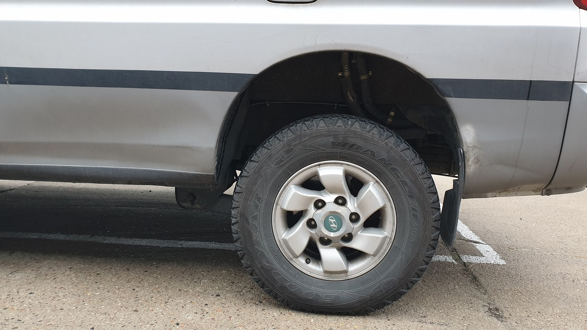

# 🛠️ Lift Zawieszenia Tył +2" (OME 2898)
# 🛠️ Rear Suspension Lift +2" (OME 2898)

---

## [PL] Opis modyfikacji
Standardowy tył w Starexie często "siada", zwłaszcza pod obciążeniem wyprawowym. Zastosowanie sprężyn od **Toyoty Land Cruiser J15 (Prado 150)** to idealne rozwiązanie typu Plug & Play.

### Specyfikacja:
* **Model:** OME 2898 (Old Man Emu)
* **Charakterystyka:** Lift do 50mm, stałe obciążenie +200kg.
* **Montaż:** Pasuje idealnie, bez żadnego rzeźbienia (sprężyna jest o 6mm dłuższa od oryginału, ale znacznie sztywniejsza).

### Efekty:
* **Na pusto:** Auto idzie w górę o **5 cm**.
* **Z obciążeniem:** Przy stałej zabudowie (webasto, sprzęt, drabina, spanie), tył podniósł się o **3 cm**.

*Foto 1: Stan przed modyfikacją.*

*Foto 2: Efekt końcowy (załadowany).*

*Foto 3: Postawa auta po zmianie sprężyn.*

*Foto 4: Zastosowane sprężyny OME 2898.*

---

## [EN] Modification Overview
The stock rear suspension in the Starex often sags, especially when loaded with camping gear. Using **Toyota Land Cruiser J15 (Prado 150)** springs is a perfect Plug & Play solution.

### Specs:
* **Model:** OME 2898 (Old Man Emu)
* **Rating:** Up to 50mm lift, constant load +200kg.
* **Fitment:** Direct fit, no modifications required (spring is 6mm longer than OEM but significantly stiffer).

### Results:
* **Unloaded:** Rear lifted by **5 cm**.
* **Loaded:** With full camping setup (webasto, gear, ladder, bed), the rear lifted by **3 cm**.

---
**Parts Used / Użyte części:** OME 2898 (Toyota J15)
**Difficulty / Trudność:** Easy (Plug & Play)
