# Stalowa osłona silnika Kolchuga  
# Steel Engine Skid Plate Kolchuga - PL/EN  

---

## [PL] Opis modyfikacji  
Solidna stalowa osłona silnika ukraińskiego producenta Kolchuga (model 2.0144.00 ZiPoFlex).  
Zabezpieczona ocynkiem, malowaniem proszkowym oraz specjalną warstwą lakieru ZiPoFlex.  

### Gdzie kupić:  
* **Producent:** [kolchuga.net.ua](https://kolchuga.net.ua/ua/products/hyundai-h1)  
* **Sklep UA (Lwów):** [rozetka.com.ua](https://rozetka.com.ua/127720395/p127720395/)  
* **Oddział PL:** [kolchuga.pl](https://kolchuga.pl/)  

### Uwagi do montażu:  
Wszystko pasuje idealnie poza jednym detalem. Z przodu rama ma profil zamknięty, co uniemożliwia włożenie fabrycznych podkładek z gwintem.  
**Rozwiązanie:** Należy nawiercić nowe otwory w osłonie i przykręcić ją w miejscach, gdzie wcześniej była przykręcona plastikowa osłona. Z tyłu rama jest otwarta, więc montaż przebiega bezproblemowo.  

---

## [EN] Modification Details  
Heavy-duty steel engine skid plate by Ukrainian manufacturer Kolchuga (model 2.0144.00 ZiPoFlex).  
Protected by galvanization, powder coating, and a special ZiPoFlex lacquer layer.  

### Installation Notes:  
The fitment is almost perfect, except for the front section. The front chassis frame is a closed profile, making it impossible to insert the provided threaded washers.  
**Fix:** Drill new holes in the skid plate and bolt it to the existing mounting points used by the original plastic cover. The rear section of the frame is open, so the provided hardware works perfectly there.  

---

## 📸 Dokumentacja Foto / Photo Documentation  

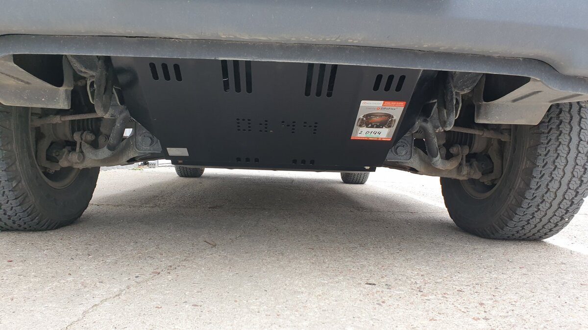  
*PL: Tak wygląda po założeniu – kawał solidnej blachy.*  
*EN: Installed view – a very solid piece of steel.* !

[Opakowanie](../img/oslona/kol02.jpg)  
*PL: Przychodzi bardzo dobrze zapakowane i zabezpieczone.*   
*EN: Very well packaged and protected during transport.* 

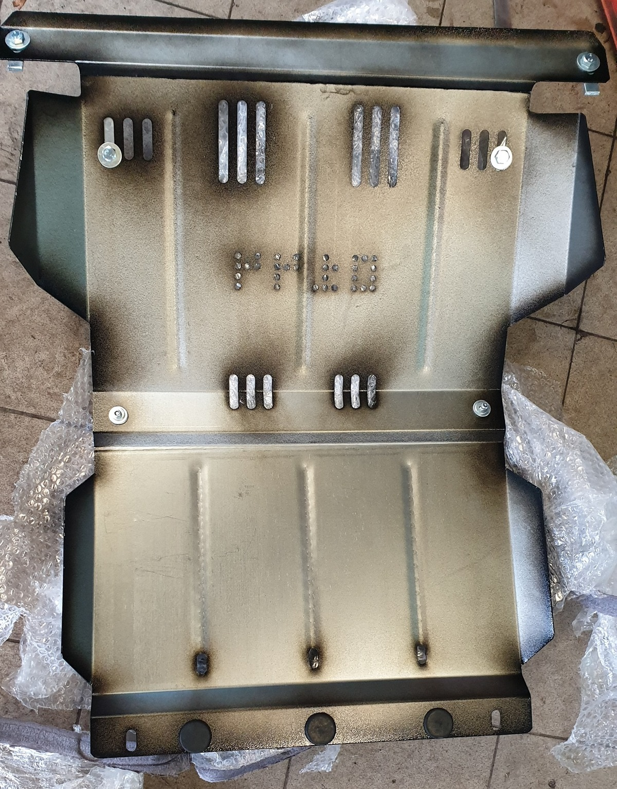  
*PL: Z tyłu posiada gumki zabezpieczające przed hałasem i wibracjami.*   
*EN: Rubber dampeners on the back to prevent noise and vibrations.* 

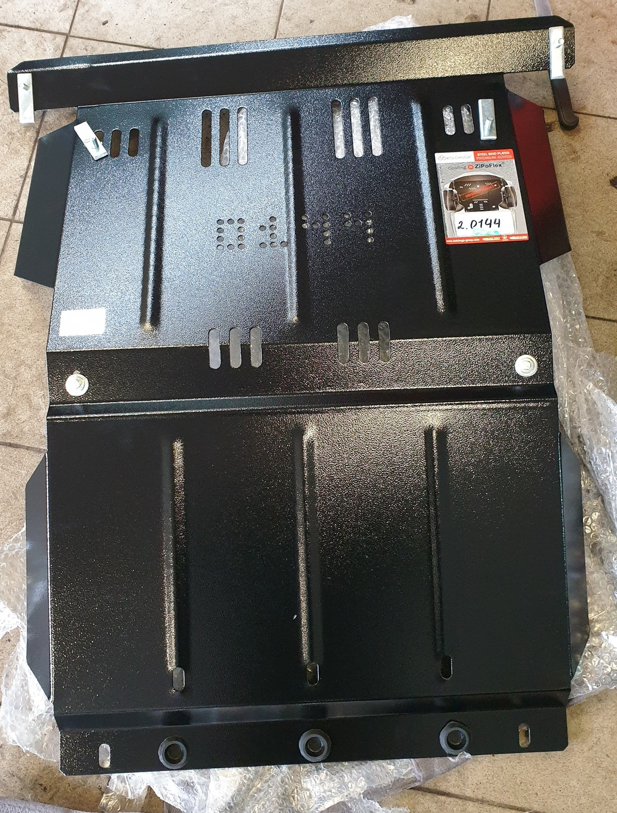  
*PL: Ocynk, proszek i warstwa ZiPoFlex.*   
*EN: Galvanized, powder coated, and finished with ZiPoFlex.* 

  
*PL: Widok spodu po zdjęciu plastiku. Oryginał całkiem skorodował.*   
*EN: Underbody view with plastic cover removed. Original metal plate was completely rusted.* 

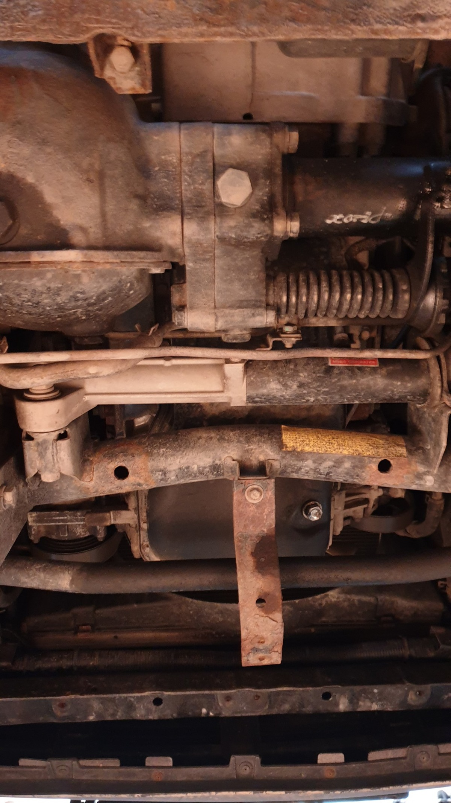  
*PL: Tu widać konieczność nawiercenia nowych otworów z przodu.*   
*EN: Here you can see where new holes need to be drilled at the front.* 

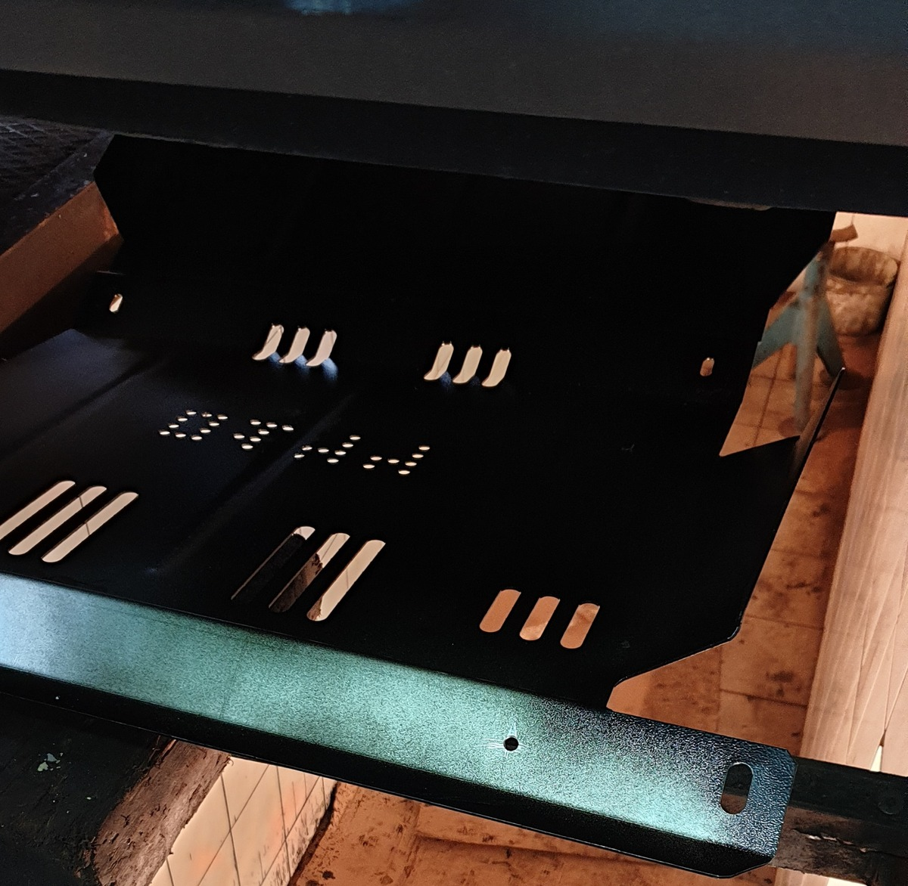  
*PL: Fotka podkładki gwintowanej pod otwory w ramie.*  
*EN: Photo of the threaded washer for the frame holes.* 

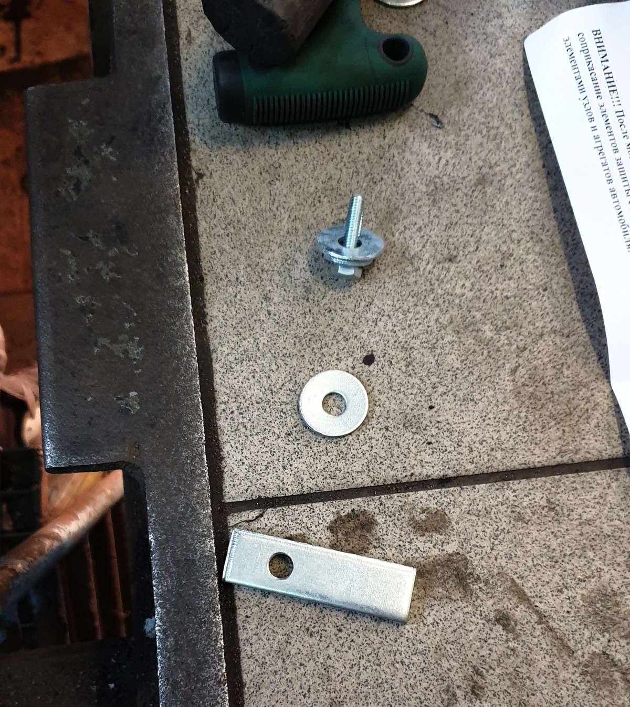  
*PL: Przy uchu holowniczym otwory pasują, ale profil ramy jest zamknięty.*  
*EN: Holes align with the tow hook, but the frame profile is closed.*

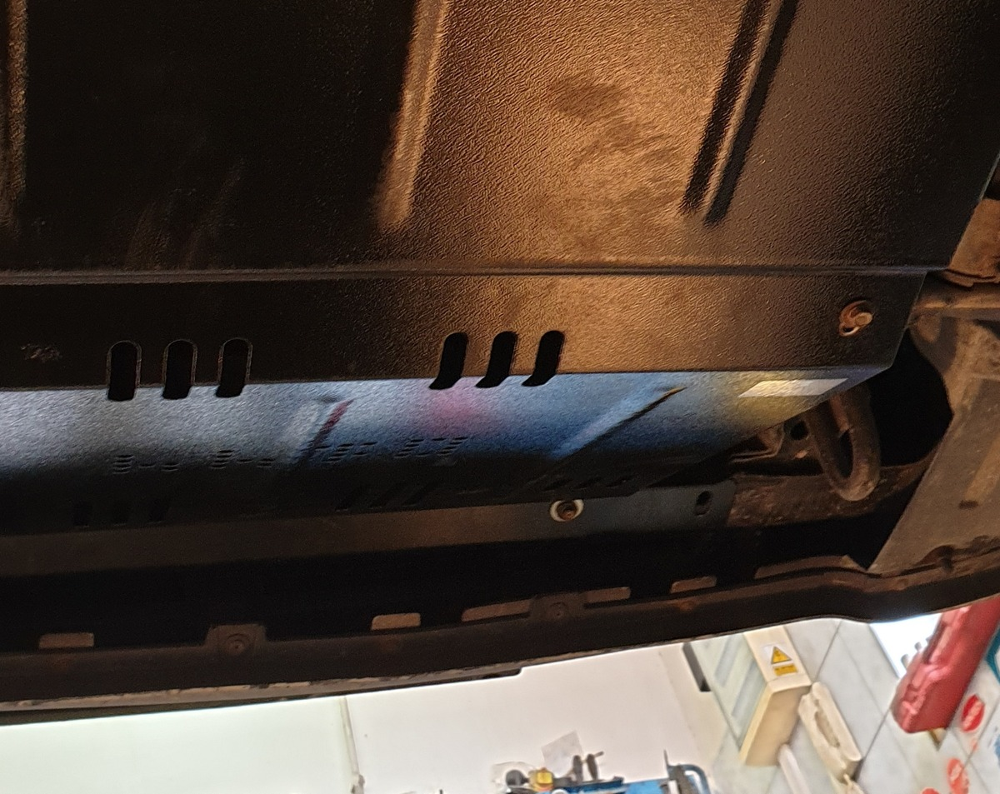  
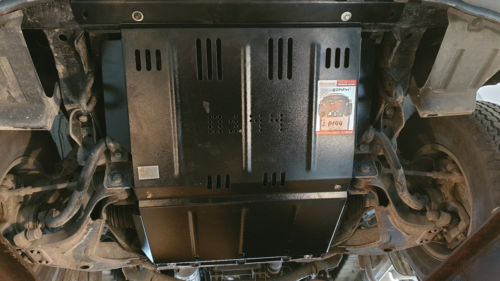  
*PL: Detale wykonania i zagięć.*   
*EN: Details of the build quality and bends.*

 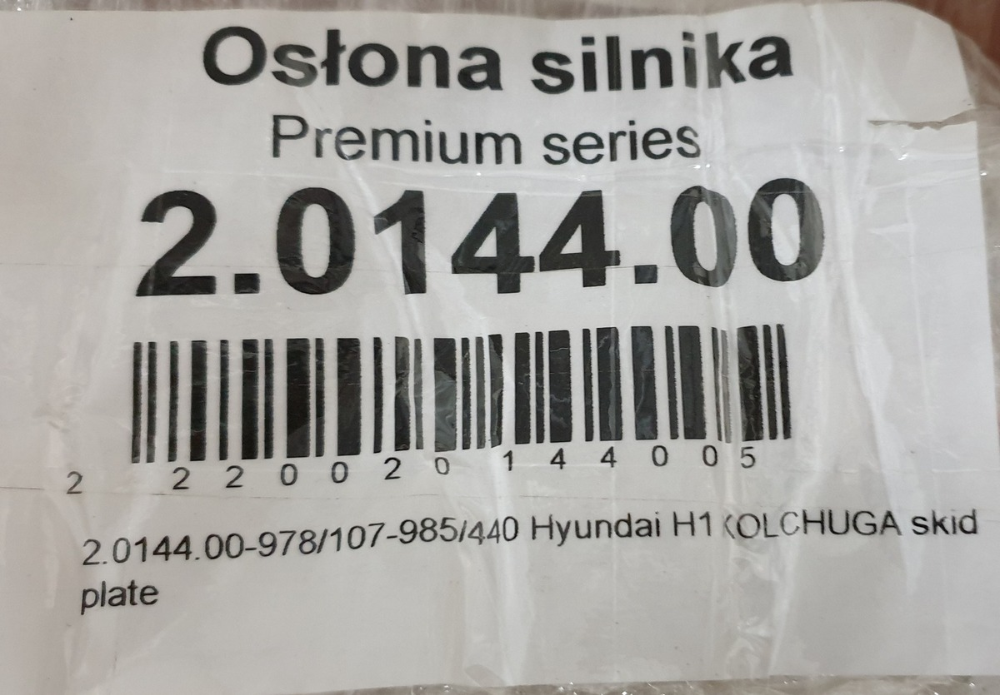  
*PL: Kod kreskowy i dokładny numer części.*   
*EN: Barcode and exact part number.* 

### 📄 Instrukcja montażu / Installation Manual  

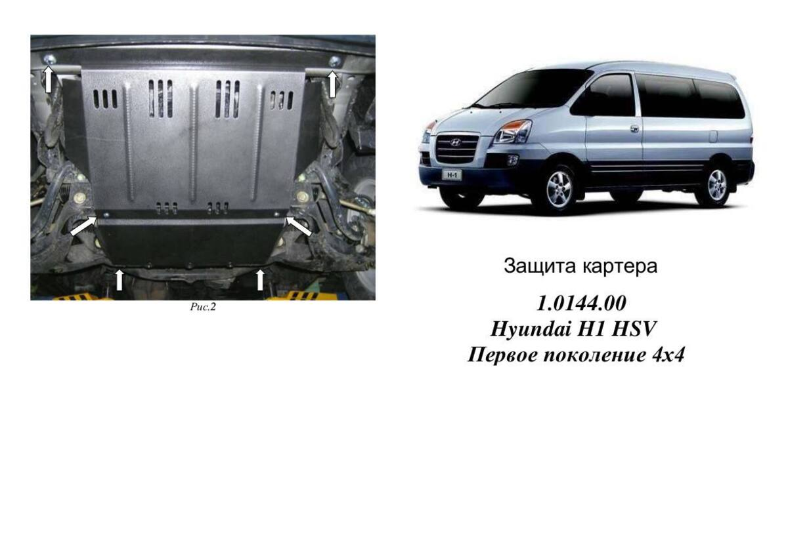  
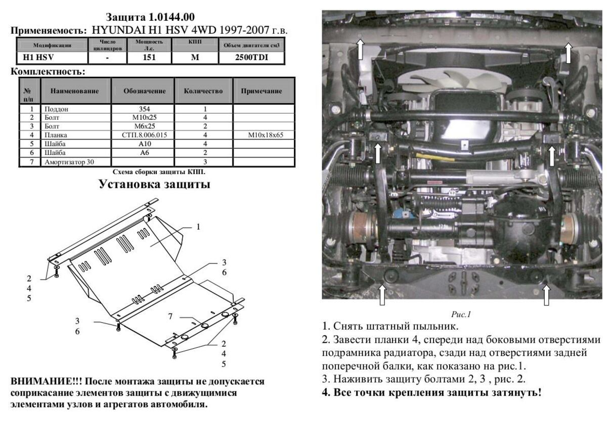  

---
**Status:** Przetestowane. Chroni miskę i nie dzwoni na wybojach! Bardzo dobra jakość - po kilku latach używania nie ma żadnych oznak korozji!
