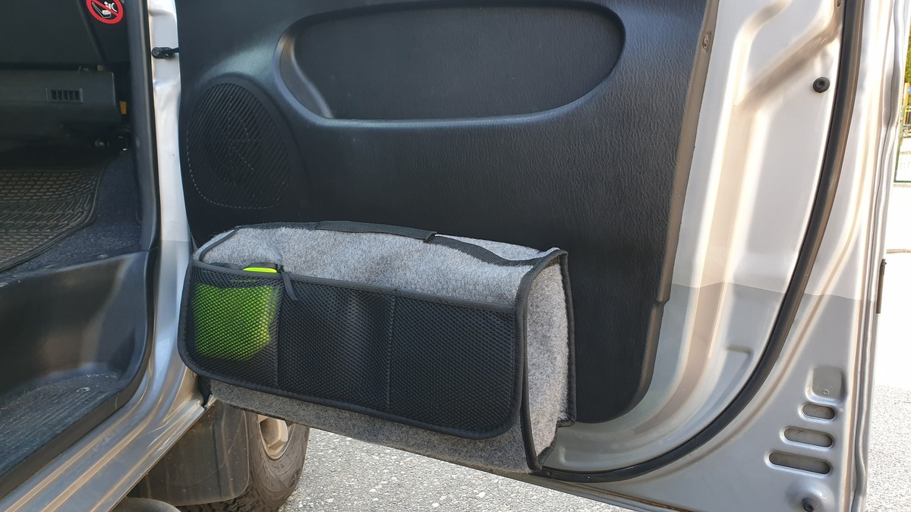
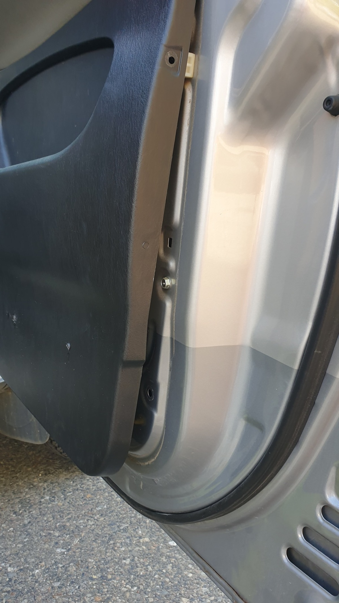
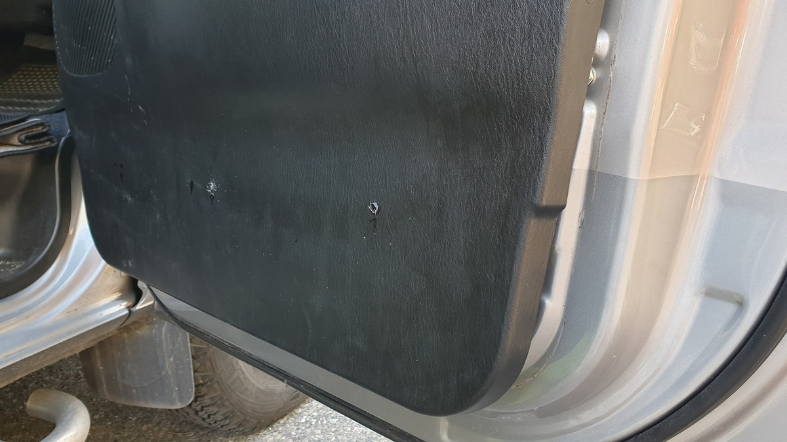
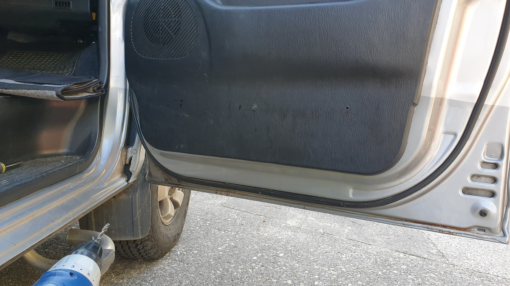
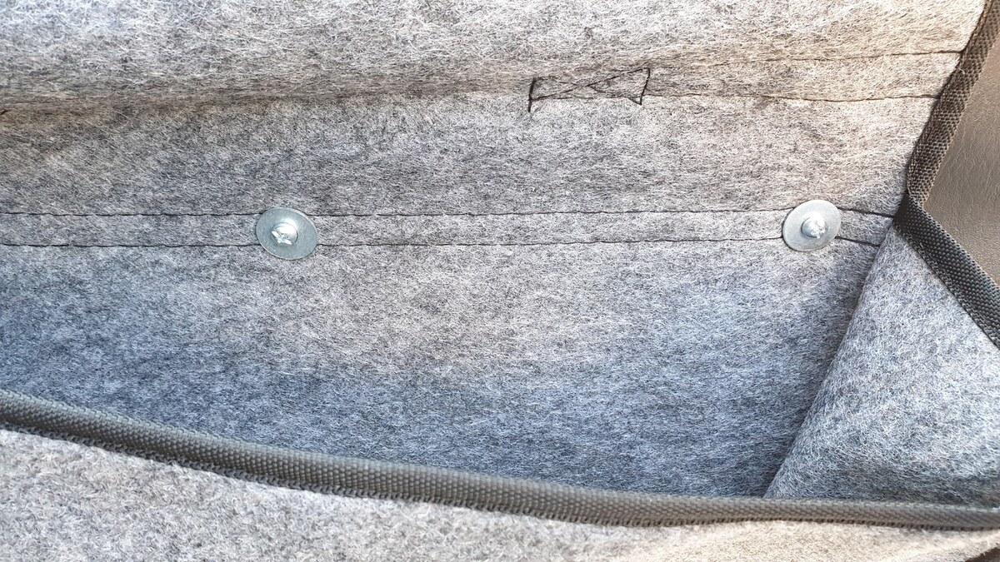
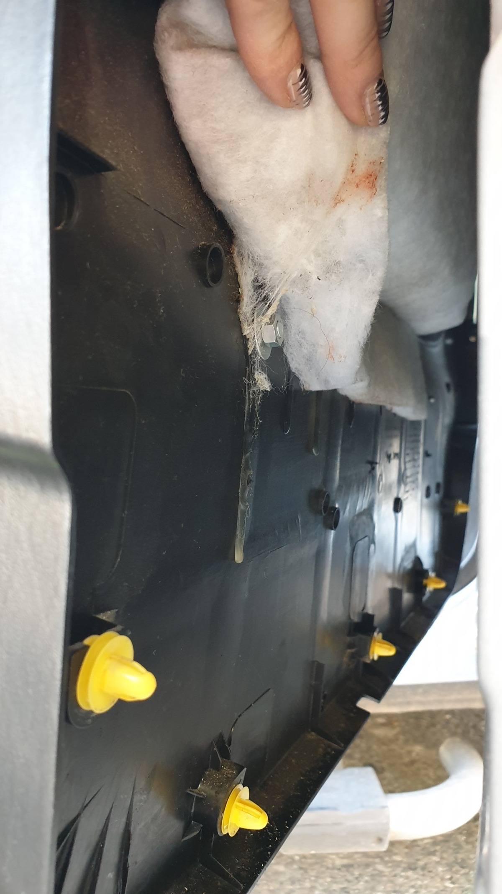
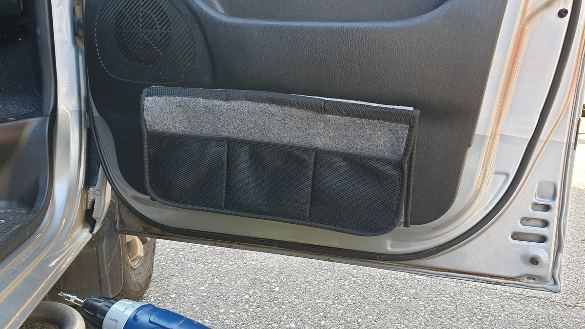
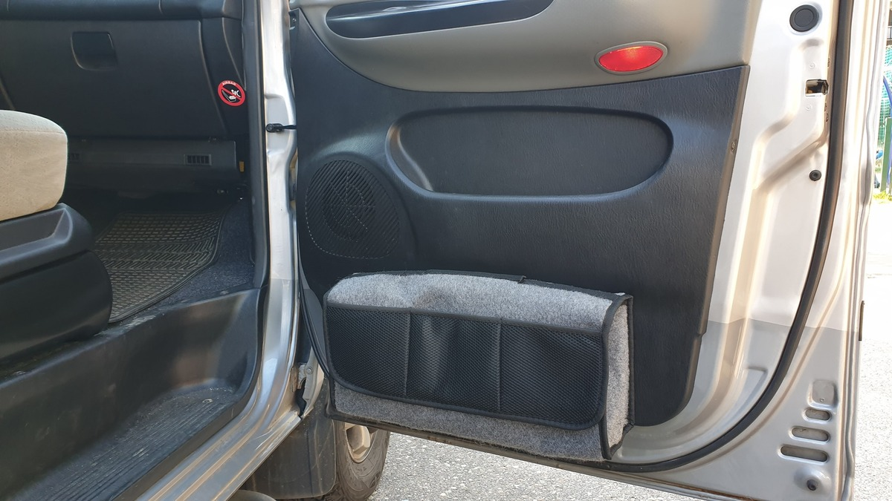
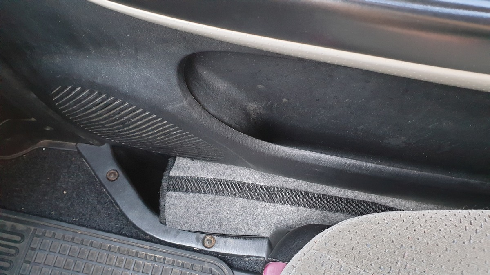

# Sakwy na przednie drzwi (Organizery)  
# Front Door Storage Bags (Organizers) - PL/EN  

---

## [PL] Opis modyfikacji  
Wykorzystanie najtańszych marketowych sakiewek do bagażnika jako bocznych organizerów w przednich drzwiach.  
Modyfikacja idealnie rozwiązuje problem pustej przestrzeni w stopniu wejściowym, w którą często wpadają rzeczy podczas wypraw.  

### Instrukcja montażu:  
1. **Demontaż boczka:** Odkręcamy 3 śrubki i podważamy dół boczka przez specjalny otwór, aż odskoczy z zatrzasków.  
2. **Wiercenie:** Należy zrobić 3 otwory. Uwaga: najlepiej celować kilka cm wyżej niż na zdjęciu, tuż przed przetłoczeniem boczka.  
3. **Mocowanie:** Całość można wykonać bez całkowitego zdejmowania boczka – wystarczy go odchylić od dołu.  
4. **Zakończenie:** Od wewnątrz stosujemy podkładkę z gumką i nakrętkę dla pewnego trzymania.  

---

## [EN] Modification Details  
Using cheap supermarket trunk organizers as side door pockets for the front doors.  
This mod perfectly fills the "step gap" that usually swallows small items during off-road trips.  

### Installation Steps:  
1. **Door Panel Removal:** Remove 3 screws and pry the bottom of the panel through the dedicated slot until the clips pop out.  
2. **Drilling:** Drill 3 holes. Pro-tip: aim a few cm higher than shown in the photos, right before the panel's contour line.  
3. **Attachment:** The job can be done by just leaning the panel out from the bottom, no need to remove the whole thing.  
4. **Securing:** Use a washer with a rubber seal and a nut on the inside for a secure fit.  

---

## 📸 Dokumentacja Foto / Photo Documentation  

  
*PL: Widok ogólny. / EN: General view.*   
*PL: Odkręcamy 3 śruby i podważamy boczek od dołu.* *EN: Remove 3 screws and pry the panel from the bottom.*   
*PL: Miejsce wiercenia – celuj kilka cm powyżej tego co na foto, przed przetłoczeniem.* *EN: Drilling points – aim a few cm higher than pictured, before the contour.*   
*PL: Można montować bez zdejmowania całego boczka.* *EN: Can be installed without removing the entire door panel.*   
*PL: Sposób przykręcenia sakwy do boczka.* *EN: Method of attaching the bag to the panel.*   
*PL: Podkładka z gumką i nakrętka (w kadrze paznokcie żony 😉).* *EN: Washer with rubber and a nut (plus wife's nails in the frame 😉).*   
*PL: Pusta sakwa (Auchan) – wymiarowo pasuje idealnie.* *EN: Empty bag (from Auchan) – fits the dimensions perfectly.*   
*PL: Sakwa z wypełnieniem (apteczka, klucze).* *EN: Bag filled with gear (first aid kit, tools).*   
  
*PL: Idealnie zapełnia otwór przy schodkach.* *EN: Perfectly fills the gap by the steps.* ---
**Status:** Przetestowane. Nic już nie wpada pod nogi przy wsiadaniu!
