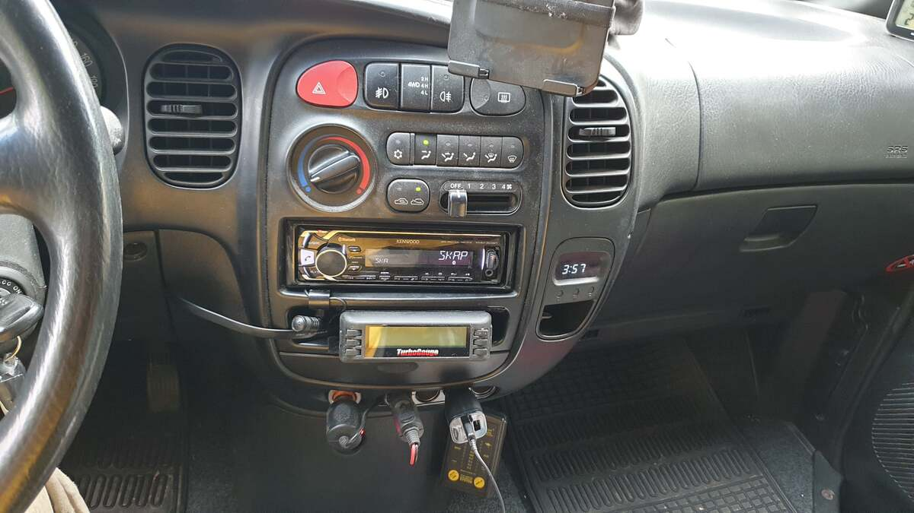
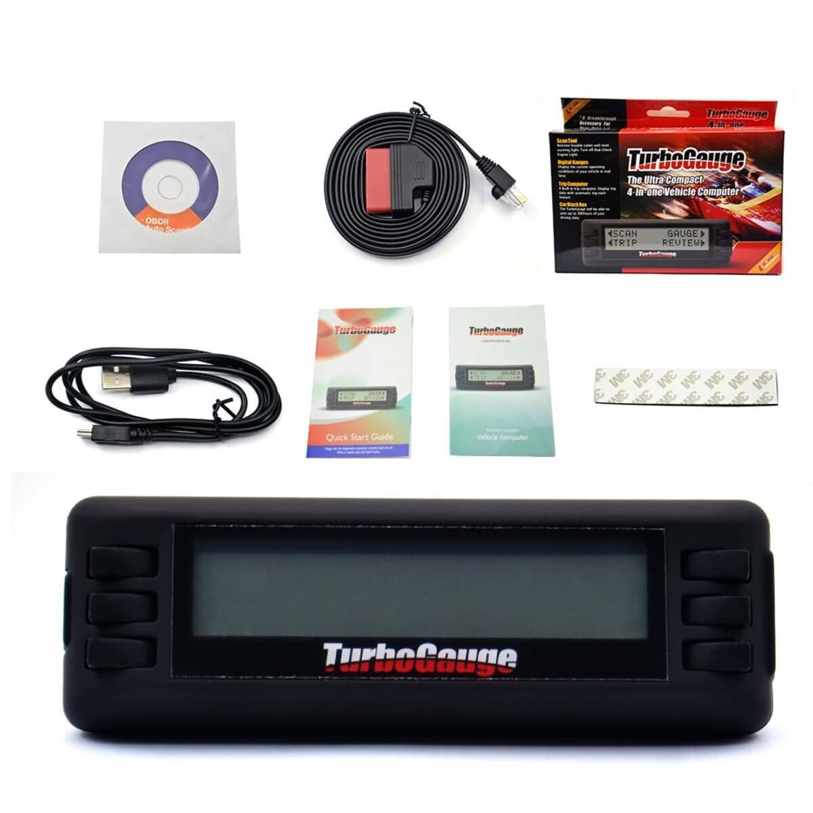
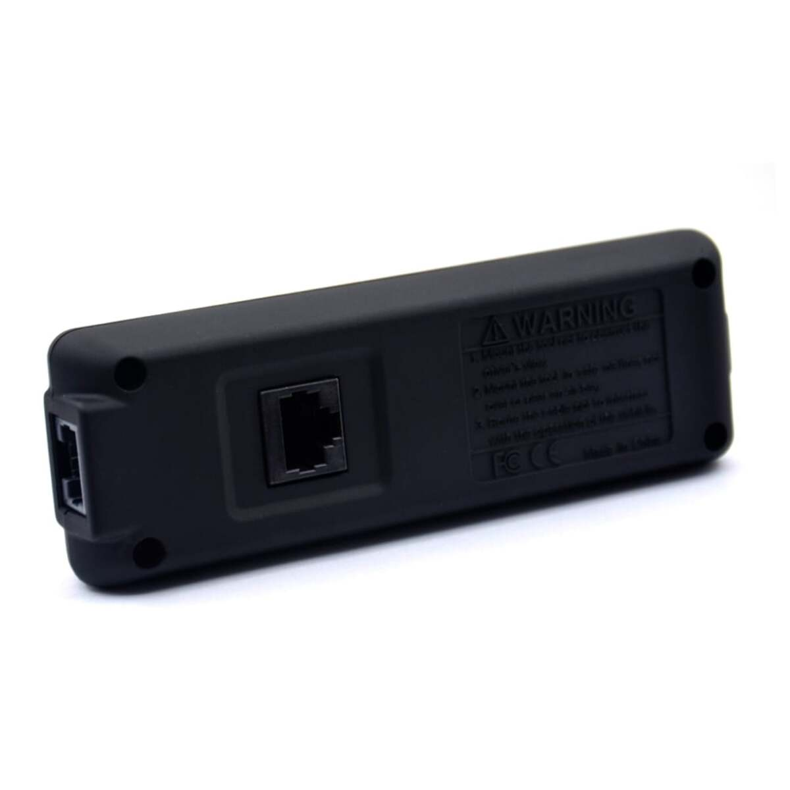
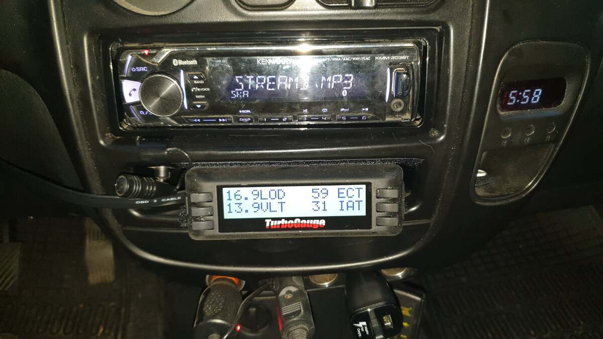
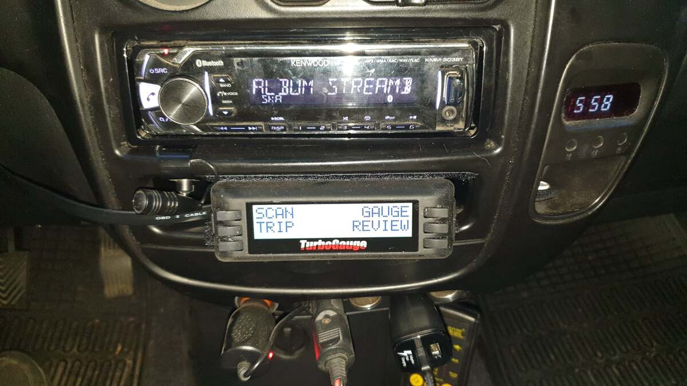
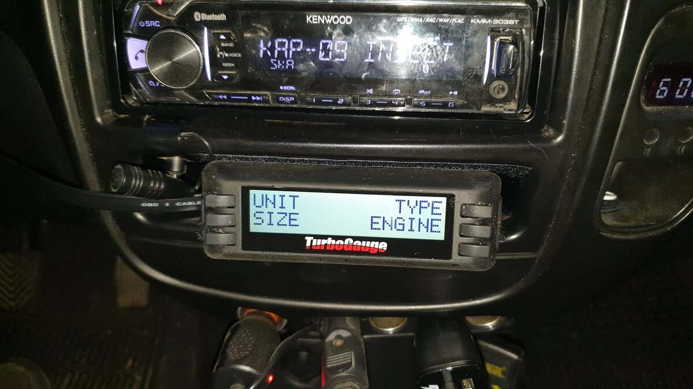
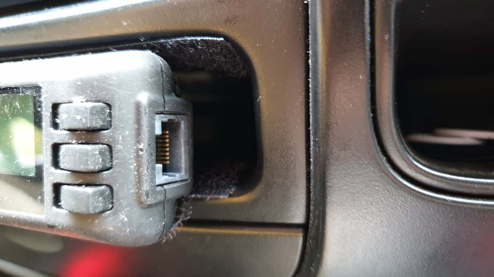
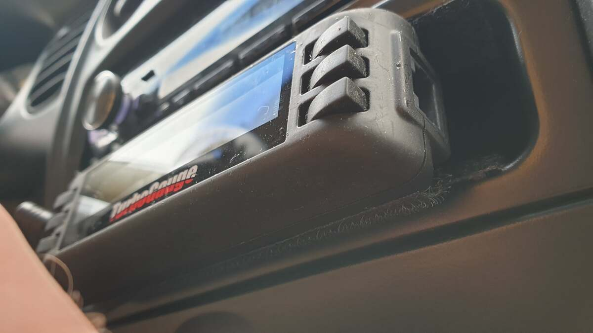

# Komputer pokładowy TurboGauge (OBD)  
# TurboGauge On-Board Computer (OBD) - PL/EN  

---

## [PL] Opis modyfikacji  
Instalacja komputera pokładowego TurboGauge podłączanego bezpośrednio pod gniazdo OBD II. Urządzenie pozwala na monitorowanie kluczowych parametrów silnika w czasie rzeczywistym, co jest niezwykle przydatne podczas wypraw.  

### Wyświetlane parametry:  
* Obroty silnika (RPM).  
* Napięcie ładowania akumulatora.  
* Temperatura płynu chłodzącego (Water Temp).  
* Temperatura zasysanego powietrza (Intake Air Temp).  
* Można dobrać inne własne

### Montaż:  
Komputer został zamontowany w miejscu fabrycznej kieszeni pod radiem. Do mocowania użyłem mocnego rzepa samoprzylepnego na rogach urządzenia oraz wewnątrz wnęki – rozwiązanie trzyma solidnie nawet na wybojach.  

---

## [EN] Modification Details  
Installation of the TurboGauge on-board computer, connected directly to the OBD II port. The device allows real-time monitoring of key engine parameters, which is essential during long-distance trips.  

### Monitored Parameters:  
* Engine RPM.  
* Battery voltage.  
* Coolant temperature (Water Temp).  
* Intake air temperature.  

### Installation:  
The computer is mounted in the factory storage pocket under the head unit. I used heavy-duty adhesive Velcro on the corners of the device and inside the pocket – it stays securely in place even on rough terrain.  

---

## 📸 Dokumentacja Foto / Photo Documentation  

  
*PL: TurboGauge w miejscu kieszeni – pasuje idealnie.*   
*EN: TurboGauge mounted in the storage pocket – perfect fit.* 

  
*PL: Kompletny zestaw zamówiony z Aliexpress.*  
*EN: Complete kit ordered from Aliexpress.* 

  
  
*PL: Widok na gniazda połączeniowe (boczne i tylne). Ja użyłem tylnego.*   
*EN: View of connection ports (side and rear). I used the rear one.*

  
*PL: Jeden z trybów wyświetlania – wirtualne zegary.*  
*EN: One of the display modes – virtual gauges.* 

  
  
*PL: Dostępne opcje w menu urządzenia.*   
*EN: Available options in the device menu.* 

  
  
  
*PL: Sposób montażu na rzep samoprzylepny – proste i skuteczne.*   
*EN: Mounting method using adhesive Velcro – simple and effective.* 

---
**Status:** Przetestowane w trasie. Wszystkie dane pod kontrolą jednym rzutem oka.
