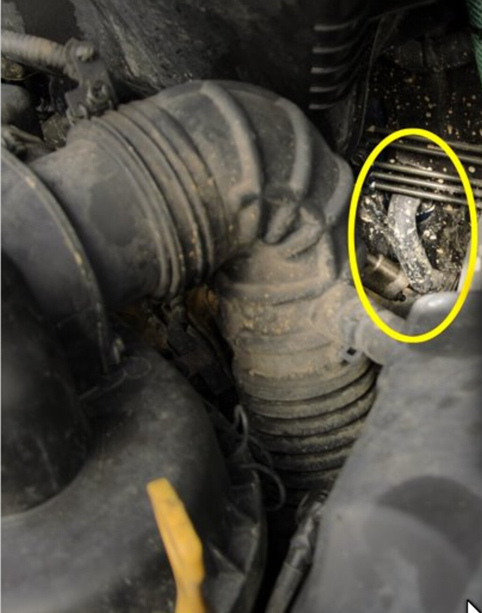
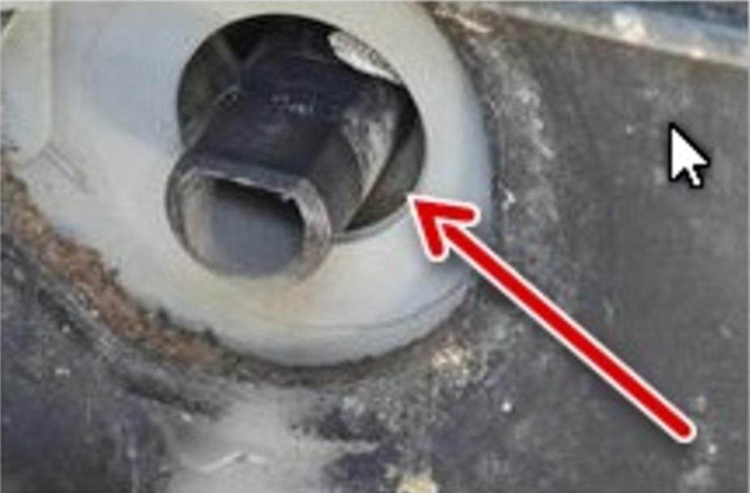
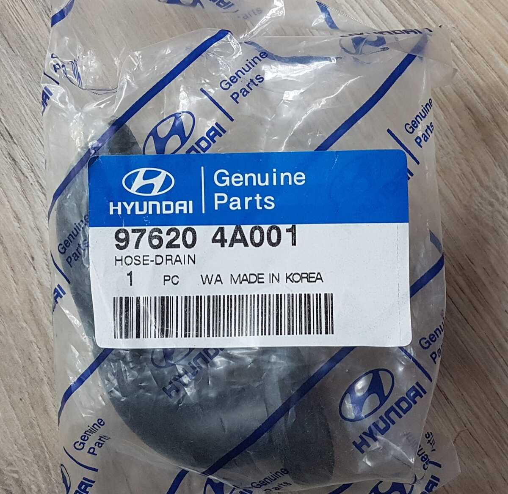
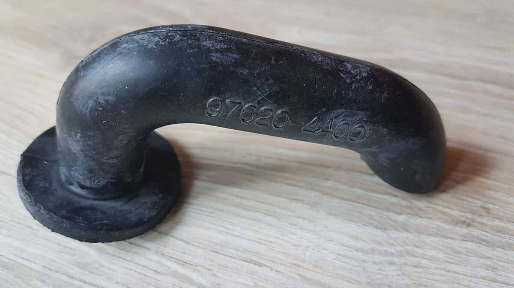
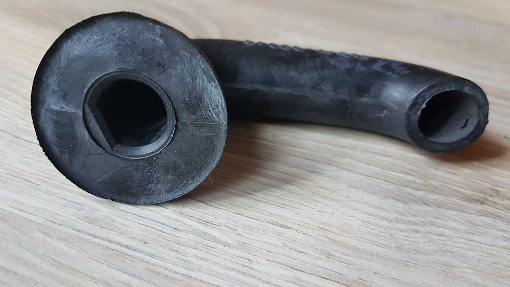

# 💧 Woda w nogach pasażera? Hack: Gumowa rurka klimatyzacji
# AC Drain Hose Fix - Water in Footwell (PL/EN)

---

## [PL] Opis problemu
Jeśli podczas używania klimatyzacji zauważysz kałużę wody w nogach pasażera lub pod jego fotelem – nie panikuj, to prawdopodobnie nie nagrzewnica. Winna jest brakująca gumowa końcówka odpływu w komorze silnika.

Gdy brakuje gumowej fajki, pęd powietrza podczas jazdy wpycha skropliny z plastikowej rurki z powrotem do wnętrza kabiny.

### 🔍 Gdzie szukać przyczyny?
Sprawdź w komorze silnika, czy na plastikowym króćcu wychodzącym z grodzi znajduje się zagięta w dół gumowa rurka.

* **Lokalizacja w komorze silnika:**

*(Miejsce zaznaczone żółtym kółkiem)*

* **Widok przybliżony (brak gumowej końcówki):**

* **Duży zoom na plastikowy króciec:**

---

## 🛠️ Rozwiązanie (Fix)
Musisz dokupić oryginalną gumową końcówkę Hyundai (tzw. "fajkę"). 

* **Numer części:** `HOSE-DRAIN 97620 4A001`
* **Zdjęcie części z numerem:**

* **Wygląd rurki (bok i dół):**
 

---

## [EN] Quick Summary
Water in the passenger footwell while using AC? The rubber drain hose in the engine bay is likely missing. Without it, air pressure pushes the water back into the cabin through the plastic outlet.

**Part Number:** `97620 4A001` (HOSE-DRAIN)
