# Wygłuszenie podłogi (Bitmat)  
# Floor Soundproofing (Bitmat) - PL/EN  

---

## [PL] Opis modyfikacji  
Kompleksowe wygłuszenie całej podłogi pojazdu przy użyciu zestawu Bitmat (5m² maty butylowej + 5m² pianki kauczukowej). Zabieg ma na celu redukcję hałasu drogowego oraz poprawę izolacji termicznej wnętrza.  

### Kluczowe uwagi:  
* **Przygotowanie:** Podłoga musi być idealnie czysta (benzyna ekstrakcyjna to podstawa).  
* **Narzędzia:** Polecam zainwestować w porządny, metalowy wałek do dociskania maty – ten z zestawu szybko się poddał.  
* **Warstwy:** Najpierw mata butylowa (tłumienie drgań), na to pianka kauczukowa (izolacja akustyczna i cieplna).  
* **Stopnie:** Na stopniach bocznych została tylko mata butylowa – dodanie pianki mogłoby uniemożliwić późniejszy montaż plastikowych osłon.  

---

## [EN] Modification Details  
Comprehensive soundproofing of the entire vehicle floor using a Bitmat kit (5m² of butyl mat + 5m² of rubber foam). The goal was to reduce road noise and improve the thermal insulation of the cabin.  

### Key Notes:  
* **Preparation:** The floor must be perfectly clean (extraction naphtha is essential).  
* **Tools:** I recommend buying a better quality roller – the one included in the kit broke down quickly during the process.  
* **Layers:** First, the butyl mat (vibration damping), followed by the rubber foam (acoustic and thermal insulation).  
* **Steps:** Only the butyl mat was applied to the side steps to ensure the plastic trim covers would still fit properly.  

---

## 📸 Dokumentacja Foto / Photo Documentation  

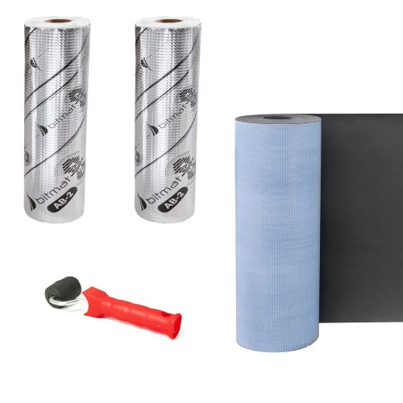  
*PL: Zestaw BITMAT: 5m2 maty i pianki. Wałek warto kupić lepszy.*   
*EN: BITMAT kit: 5m2 of mat and foam. Consider buying a better roller.* 

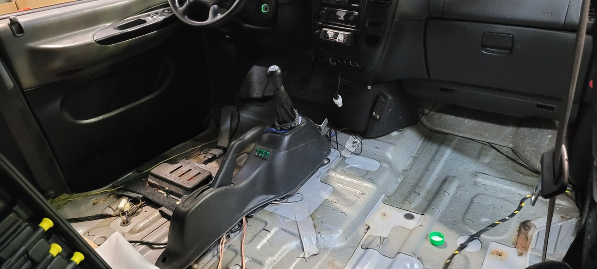  
*PL: Krok 1: Dokładne odtłuszczenie blachy.*   
*EN: Step 1: Thoroughly degreasing the metal surface.* 

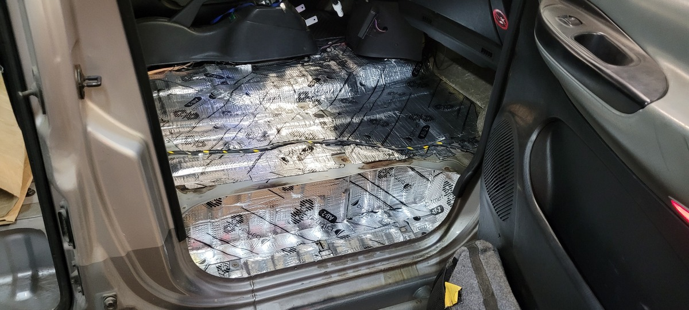  
*PL: Krok 2: Wyklejanie podłogi i stopni matą butylową.*   
*EN: Step 2: Applying the butyl mat to the floor and steps.* 

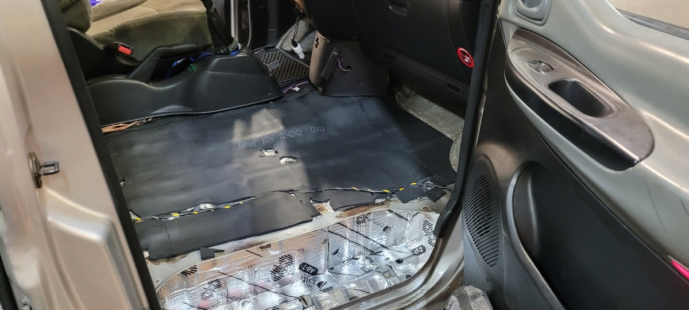  
*PL: Krok 3: Warstwa pianki kauczukowej na podłodze.*   
*EN: Step 3: Rubber foam layer on the floor.* 

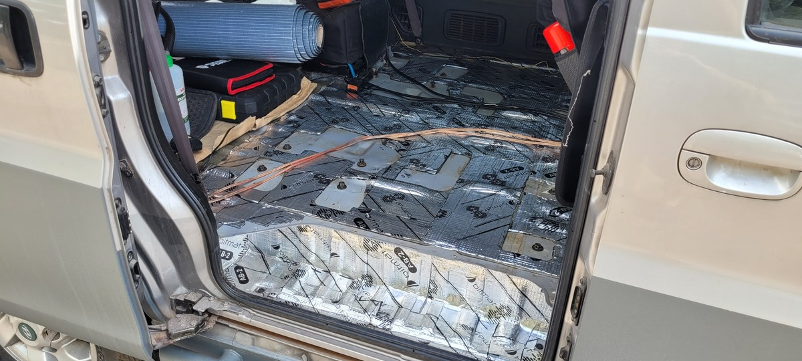  
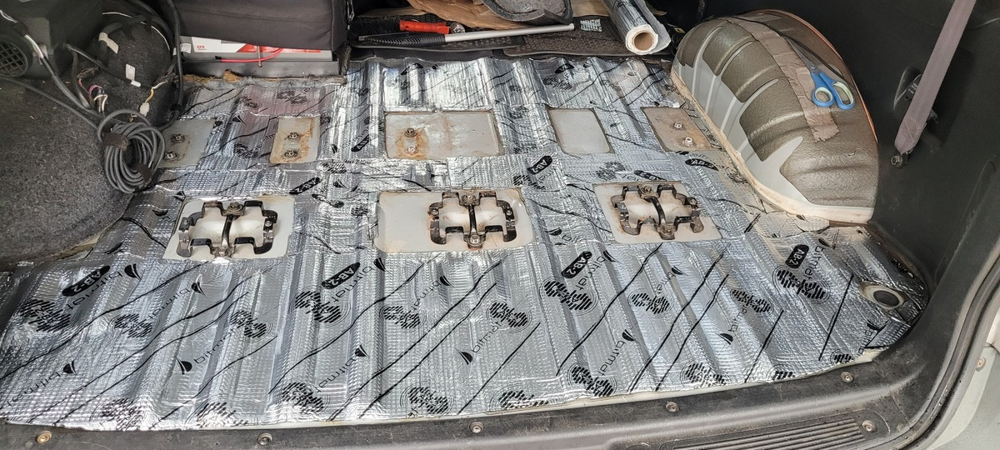  
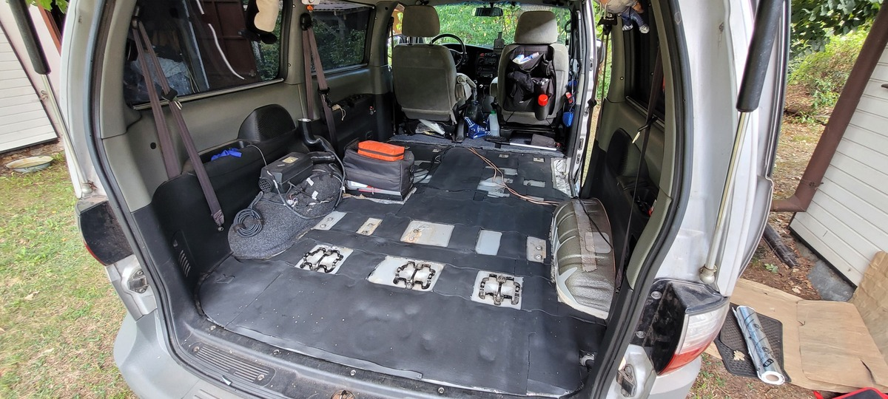  
*PL: Widok na gotowe wygłuszenie całej powierzchni tyłu.*   
*EN: View of the finished soundproofing of the entire rear area.* 

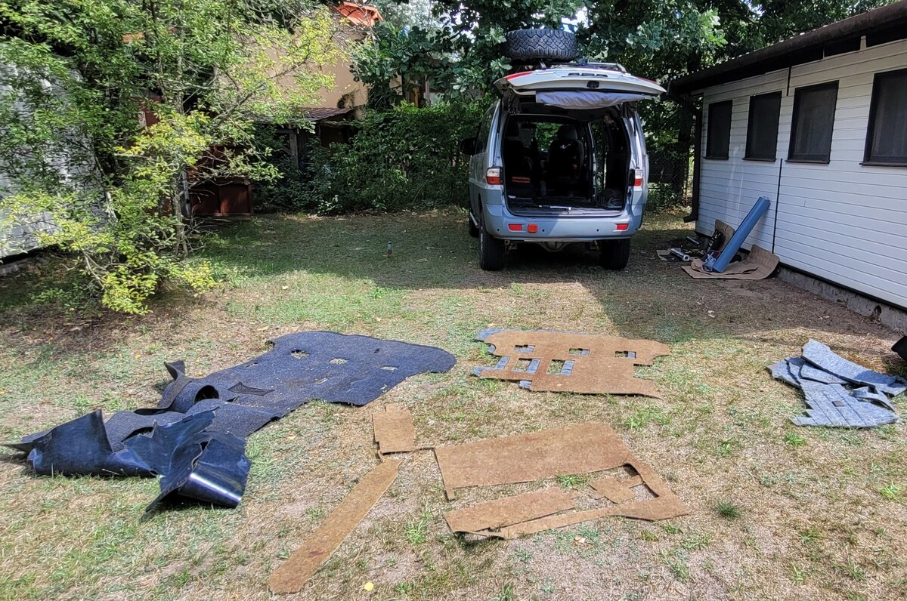  
*PL: Oryginalne materiały wygłuszające, które wracają na miejsce.*   
*EN: Original soundproofing materials being put back.* 

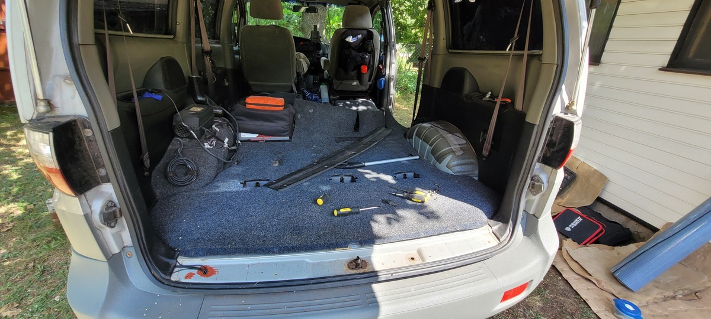  
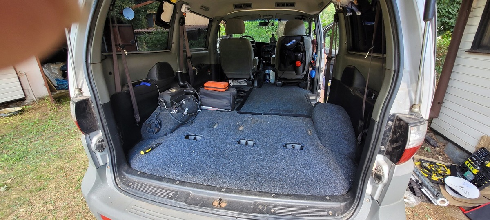  
*PL: Składanie wnętrza. Dodatkowa wykładzina zakrywa otwory po fotelach.*  
*EN: Reassembling the interior. Extra carpet covers the seat rail holes.* 

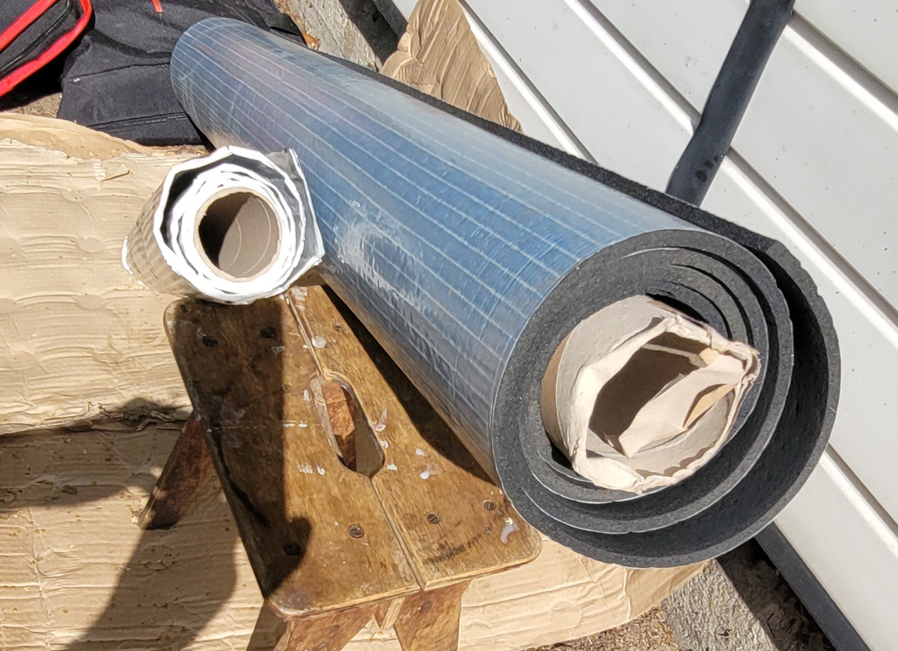  
*PL: Tyle zostało z zestawu 5m2 – wystarczy jeszcze na maskę lub boczki.*  
*EN: Remaining materials from the 5m2 kit – enough for the hood or door panels.* 

---
**Status:** Zakończono. Znaczna poprawa komfortu akustycznego w trasie.
