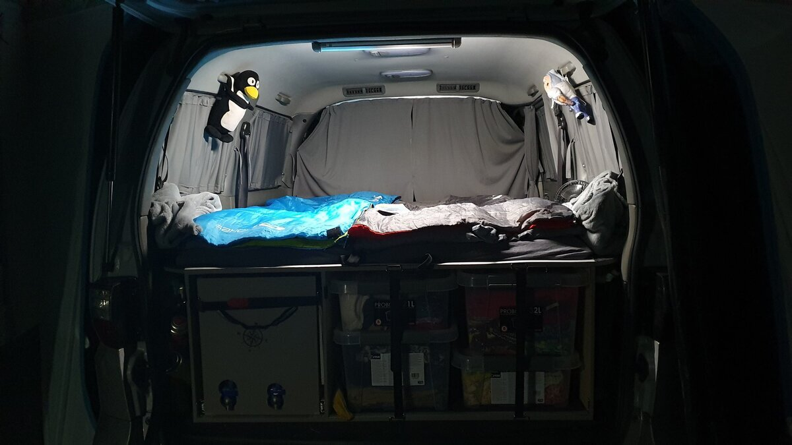
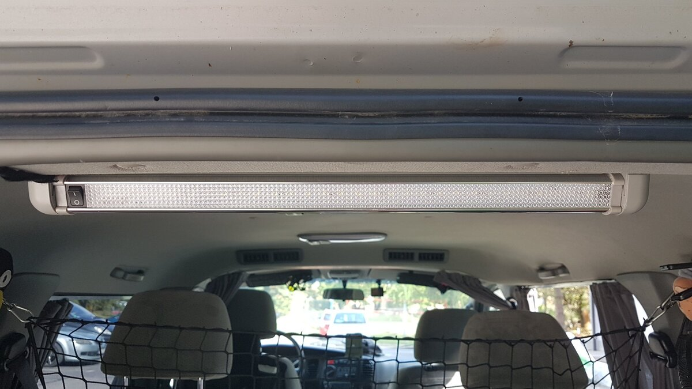
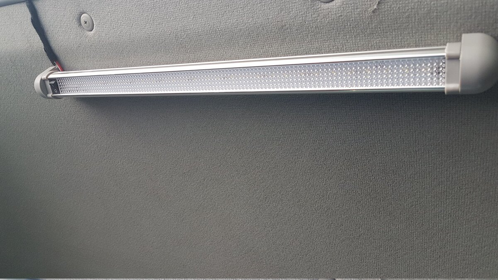

# Obrotowa lampa LED (Wnętrze/Kuchnia)
# Swivel LED Light (Interior/Kitchen) - PL/EN

---

## [PL] Opis modyfikacji
Uniwersalne oświetlenie zamontowane w tylnej części bagażnika. Lampa jest przykręcona do podsufitki na obrotowym uchwycie, co pozwala na dwa tryby pracy:
1. **Oświetlenie kabiny:** Po obróceniu do wewnątrz rozświetla całe wnętrze Starexa.
2. **Oświetlenie kuchni:** Po obróceniu na zewnątrz idealnie doświetla przestrzeń pod otwartą klapą bagażnika.

### Szczegóły techniczne:
* **Zasilanie:** Podłączona bezpośrednio pod drugi akumulator (hotelowy).
* **Sterowanie:** Posiada własny, niezależny włącznik na obudowie.
* **Wydajność:** 30 diod LED SMD zapewnia bardzo mocne, białe światło.

---

## [EN] Modification Details
Universal lighting mounted at the rear of the cargo area. The lamp is attached to the headliner using a swivel mount, allowing for two modes:
1. **Interior Lighting:** When rotated inward, it illuminates the entire cabin.
2. **Kitchen Lighting:** When rotated outward, it perfectly lights up the area under the open tailgate (outdoor kitchen).

### Technical Details:
* **Power:** Connected directly to the secondary (leisure) battery.
* **Control:** Features an independent on/off switch on the housing.
* **Performance:** 30 SMD LEDs provide very bright, white light.

---

## 📸 Dokumentacja Foto / Photo Documentation

*PL: Zdjęcie wykonane w nocy bez zewnętrznego oświetlenia. Jak widać, moc jest wystarczająca.*  
*EN: Photo taken at night with no external light source. Plenty of power for any task.*

*PL: Niezależny włącznik. Lampa nie rozładowuje akumulatora rozruchowego.*  
*EN: Independent switch. The light runs off the leisure battery, protecting the starter battery.*

*PL: Jeśli szukasz tego modelu, wpisz: **LAMPA 30 LED SMD obrotowa Paka Kabina**.*  
*EN: If you're looking for this specific model, search for: **LAMPA 30 LED SMD obrotowa Paka Kabina**.*

---
**Status:** Sprawdzone w warunkach kempingowych. Idealne do gotowania po zmroku.
