# Namiot na tylną klapę (System Flexline)  
# Rear Tailgate Tent (Flexline System) - PL/EN  

---

## [PL] Opis modyfikacji  
Adaptacja namiotu Reimo (dedykowanego do VW T4/T5) do specyfiki Hyundaia Starexa 4x4. Zrezygnowaliśmy z fabrycznego stelaża i pasów na rzecz autorskiego systemu prowadnic.  

### Główne usprawnienia:  
* **System szynowy:** Zastosowanie elastycznej szyny FLEXLINE zamontowanej na krawędzi klapy. Namiot przesuwa się na haczykach (wszyta taśma firanowa).  
* **Przedłużenie:** Ze względu na lift +2" i koła 31", namiot był za krótki – doszyto pas z wytrzymałej kodury.  
* **Uszczelnienie:** W boki namiotu wszyto magnesy neodymowe, które błyskawicznie "łapią" nadwozie.  
* **Przechowywanie:** Namiot chowa się do dedykowanej torby z kodury, przyczepionej na stałe do wewnętrznego poszycia klapy.  

---

## [EN] Modification Details  
Adaptation of a Reimo tent (originally for VW T4/T5) to the Hyundai Starex 4x4. We ditched the factory poles and straps in favor of a custom rail system.  

### Key Improvements:  
* **Rail System:** Using a FLEXLINE flexible rail mounted along the tailgate edge. The tent slides on hooks sewn into the fabric.  
* **Extension:** Due to the 2" lift and 31" tires, the tent was too short – a Cordura extension strip was added at the bottom.  
* **Sealing:** Neodymium magnets were sewn into the sides for a quick and tight fit to the car's body.  
* **Storage:** The tent is stored in a custom Cordura bag permanently attached to the inner tailgate panel.  

---

## 📸 Dokumentacja Foto / Photo Documentation  

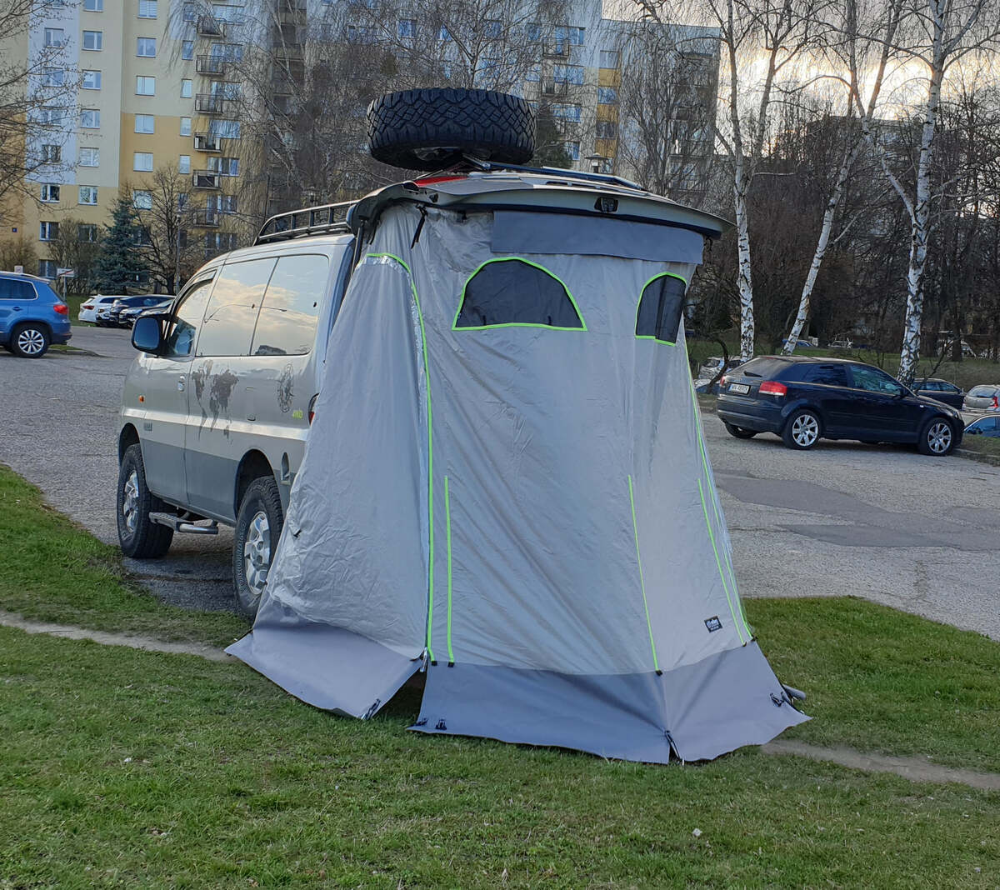  
*PL: Namiot po modyfikacjach: pas z kodury, magnesy i torba na klapie.*   
*EN: Modified tent: Cordura strip, magnets, and integrated storage bag.* 

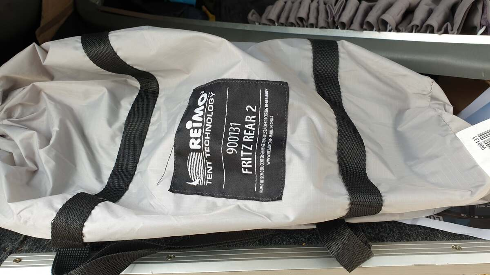  
*PL: Baza: Reimo 900131 Fritz Rear 2.*   
*EN: Base model: Reimo 900131 Fritz Rear 2.* 

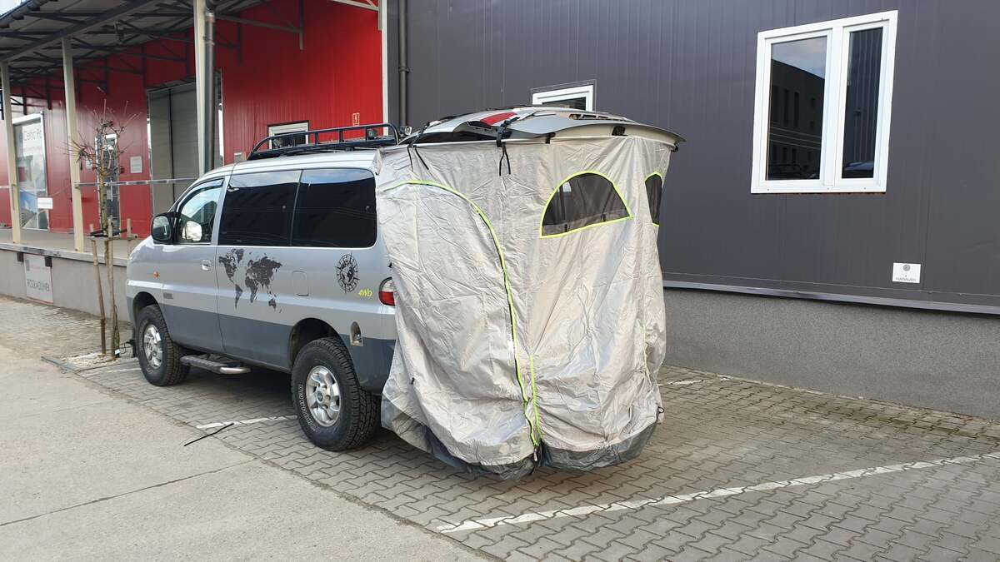  
*PL: Fabryczny montaż – za krótki i słabo dopasowany do H1.*  
*EN: Factory fit – too short and poorly fitted for the H1.* 

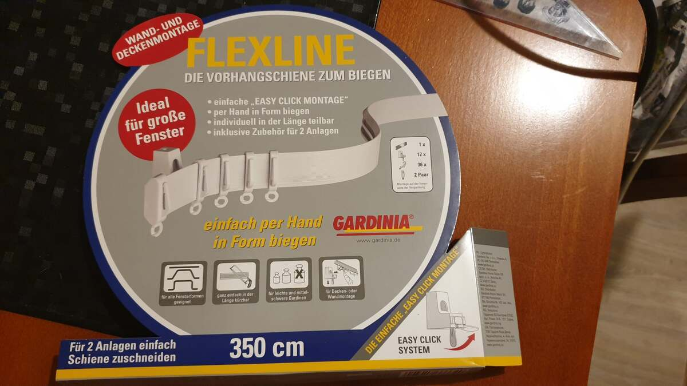  
*PL: System szyn FLEXLINE – elastyczność pozwala na prowadzenie po łukach.*  
*EN: FLEXLINE rail system – flexibility allows following the tailgate curves.* 

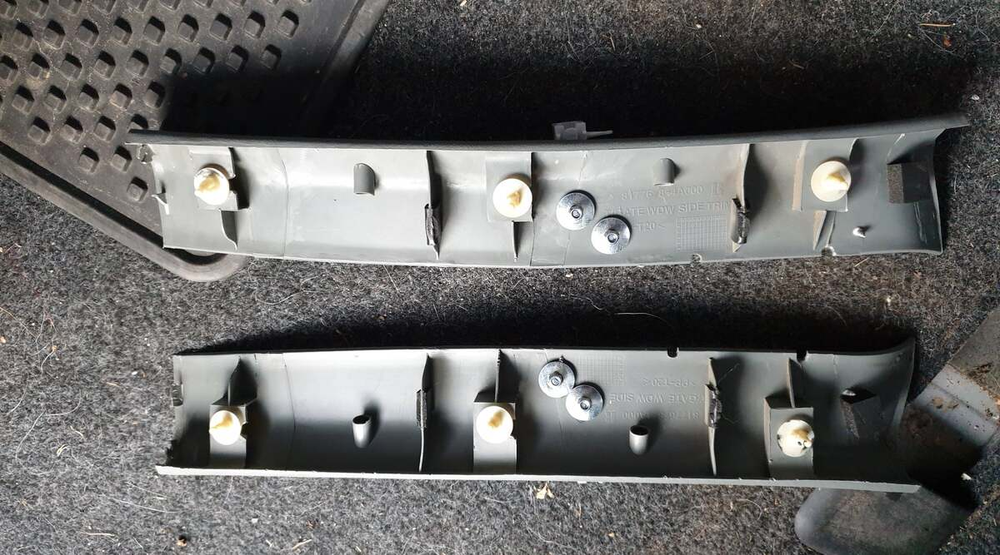  
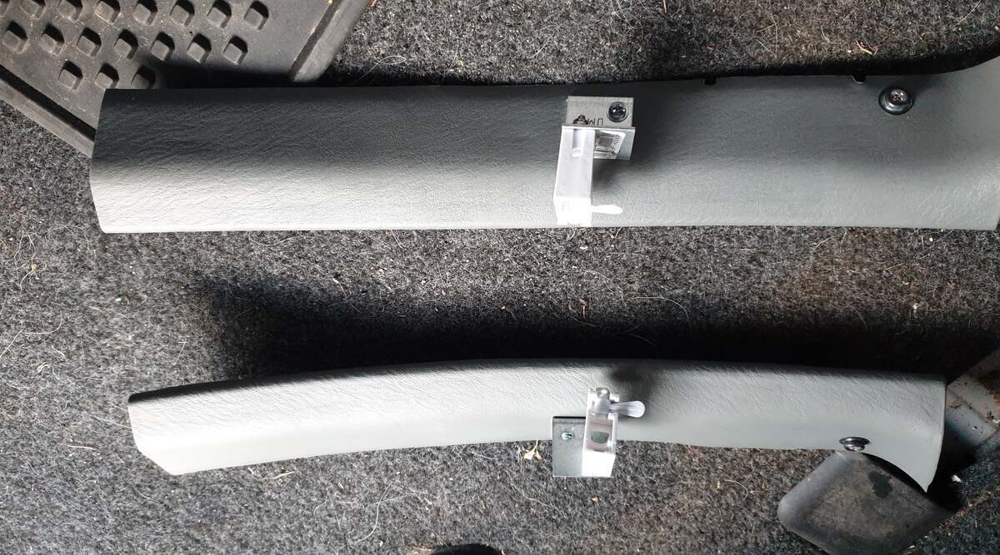  
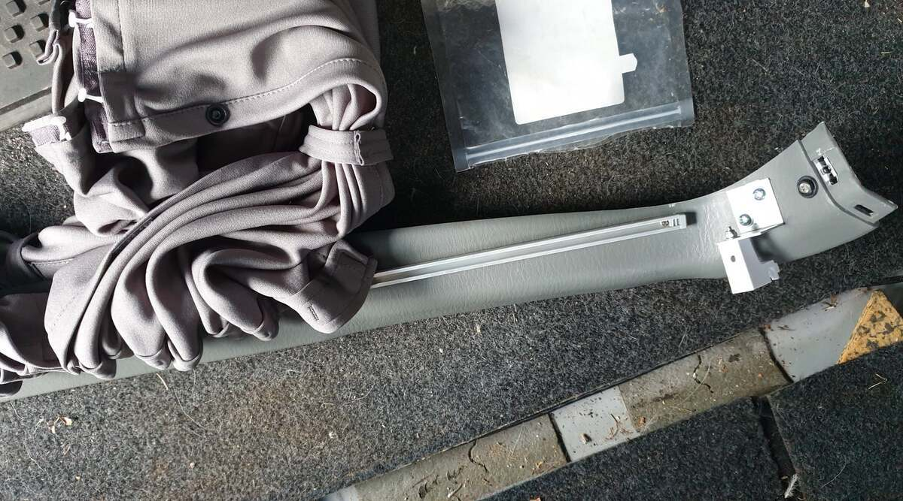  
*PL: Mocowanie szyny na śrubach i kątownikach dla równej linii.*   
*EN: Rail mounting using screws and brackets to maintain a clean line.* 

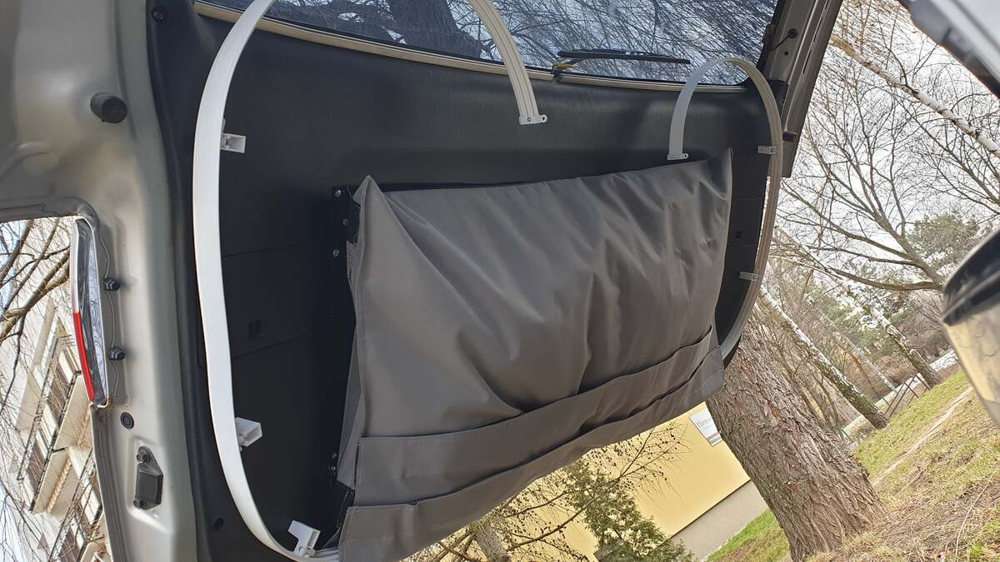  
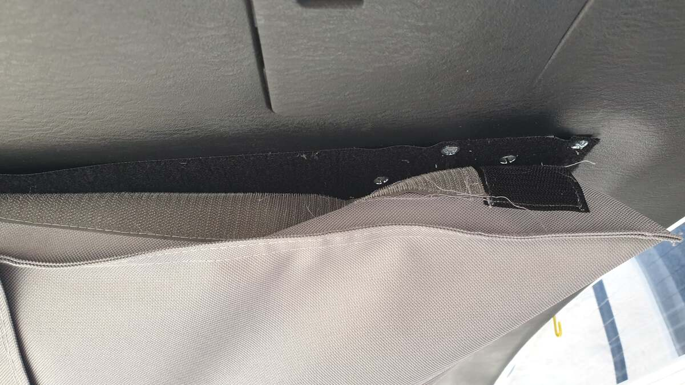  
*PL: Torba z kodury na rzepie wzmocnionym śrubami – namiot jest zawsze pod ręką.*   
*EN: Cordura storage bag on reinforced Velcro – tent is always ready.* 

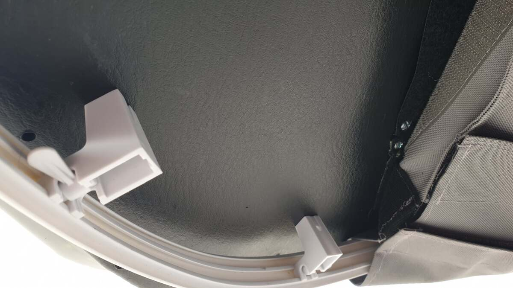  
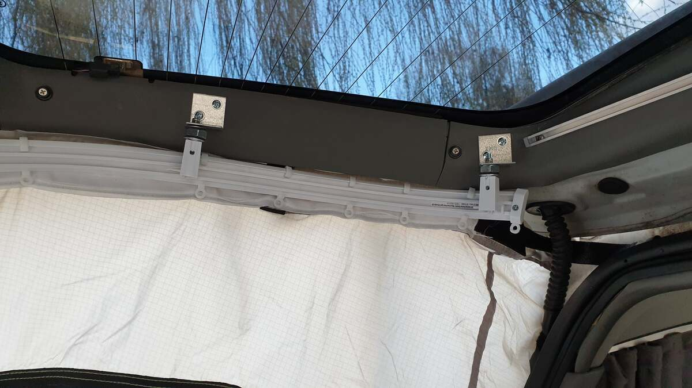  
*PL: Detale prowadzenia szyny i diy dystanse.*  
*EN: Rail routing details and DIY spacers.* 

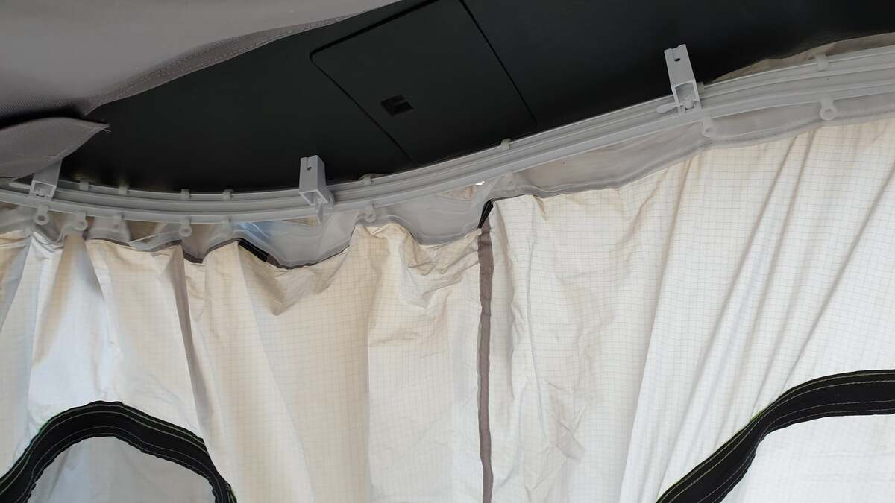  
*PL: Widok od środka – płynne prowadzenie namiotu.*  
*EN: Interior view – smooth tent sliding.* 

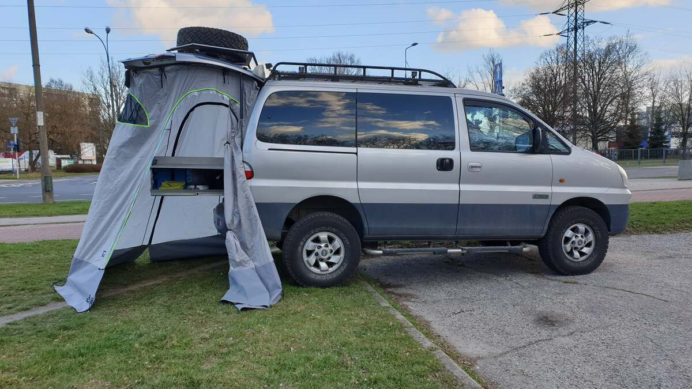  
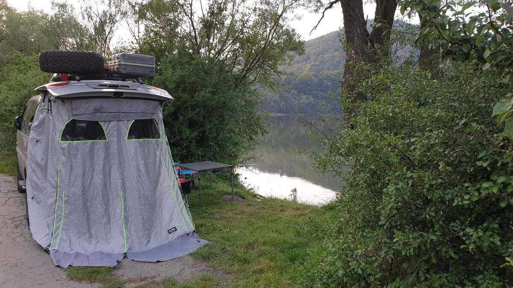    
*PL: Dużo miejsca – szuflada kuchenna mieści się bez problemu.*   
*EN: Plenty of space – kitchen drawer fits easily.* 

---
**Status:** Najczęściej używany gadżet wyprawowy. Rozkładanie trwa ok. 60 sekund.
