# Uchwyt koła zapasowego na klapę  
# Tailgate Spare Tire Carrier - PL/EN  

---

## [PL] Opis modyfikacji  
Solidny stelaż na tylną klapę umożliwiający przewożenie koła zapasowego (31") oraz dodatkowego ekwipunku. Konstrukcja odciąża wnętrze auta i zwiększa jego możliwości transportowe.  

### Kluczowe elementy:  
* **Amortyzatory:** Ze względu na ogromny ciężar, konieczna była wymiana siłowników na wzmocnione (HAHN nr 244961.5).  
  * Tryb dzienny: 1500N (stelaż + koło).  
  * Tryb wyprawowy: 1800N (koło + walizka + szpej).  
* **Mocowanie:** Górna część stelaża przykręcona do oryginalnych zawiasów klapy (wzmocnienie od wewnątrz).  
* **Stabilizacja:** Koło osadzone na piaście z dwiema dodatkowymi szpilkami stabilizującymi (dedykowane pod oryginalne felgi aluminiowe).  
* **Akcesoria:** Specjalna walizka turystyczna z aluminiowym rantem (szczelna) oraz pokrowiec wewnątrz felgi na taśmę kinetyczną.  

---

## [EN] Modification Details  
Heavy-duty tailgate rack for carrying a spare tire (31") and additional gear. This setup clears up interior space and boosts the vehicle's utility.  

### Key Components:  
* **Gas Struts:** Due to the heavy load, the original struts were replaced with reinforced HAHN units (No. 244961.5).  
  * Daily mode: 1500N (rack + tire).  
  * Expedition mode: 1800N (tire + suitcase + extra gear).  
* **Mounting:** The upper rack mounts are bolted directly to the original tailgate hinges (reinforced from the inside).  
* **Stabilization:** The tire is mounted on a hub with two extra alignment pins (specifically designed for factory alloy wheels).  
* **Accessories:** A weatherproof travel suitcase with an aluminum rim and a custom-made bag inside the rim for a kinetic recovery rope.  

---

## 📸 Dokumentacja Foto / Photo Documentation  

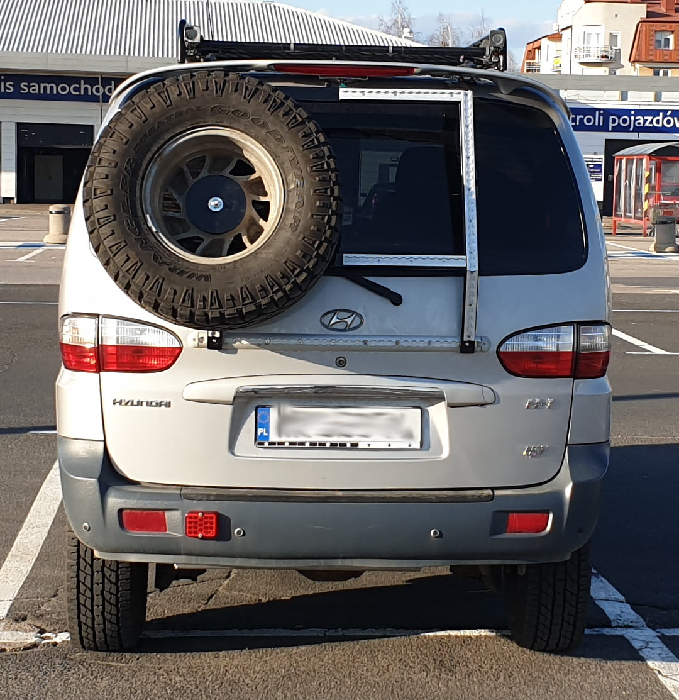  
*PL: Widok ogólny stelaża. Po prawej miejsce na dodatkowe akcesoria.*   
*EN: General view of the rack. Space for additional accessories on the right.* 

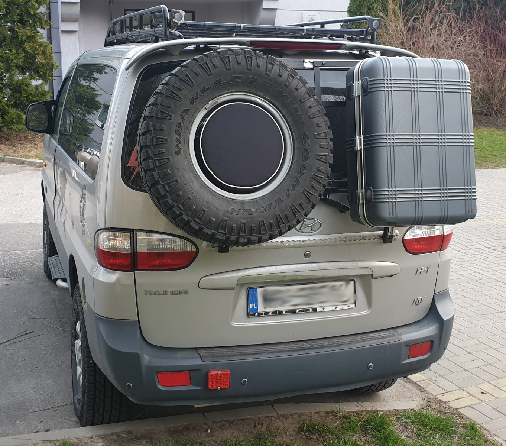  
*PL: Pokrowiec na taśmę wewnątrz koła oraz szczelna walizka wyprawowa.*   
*EN: Gear bag inside the tire and a weatherproof expedition case.* 

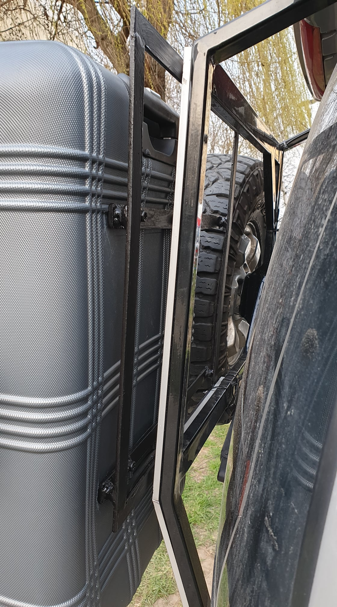  
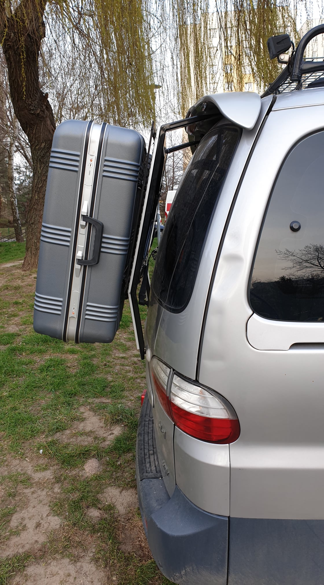  
*PL: Dodatkowy stelaż pod walizkę. Całość nie zasłania świateł.*   
*EN: Extra rack for the case. The setup does not block the lights.* 

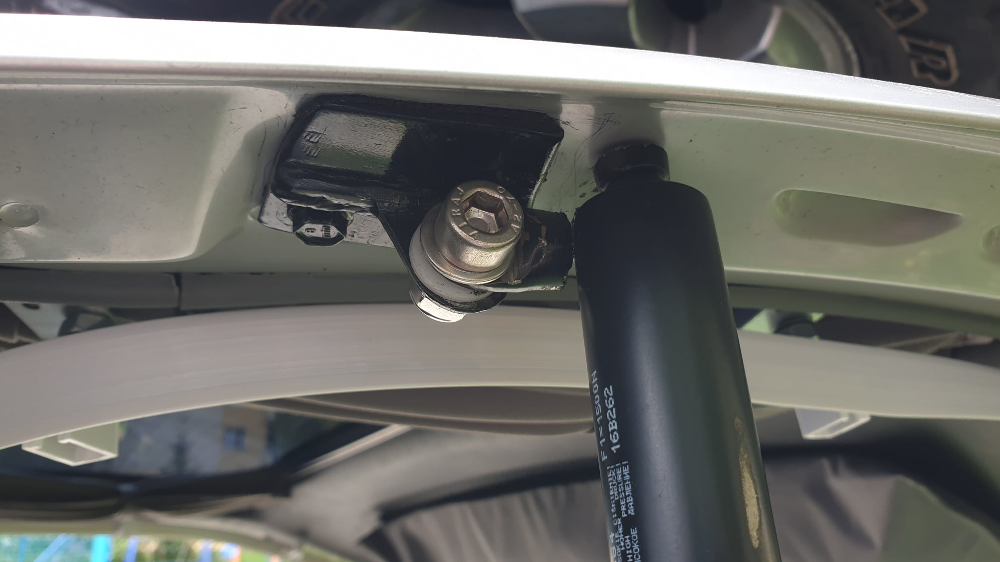  
*PL: Skutki użycia słabych amortyzatorów i zbyt dużego oporu – urwane ucho.*  
*EN: Results of poor quality struts and excessive resistance – broken mount.* 

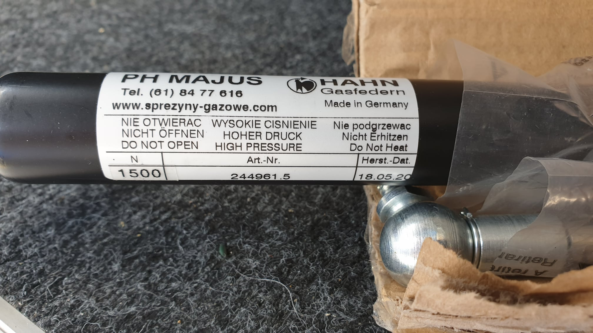  
*PL: Rozwiązanie docelowe: niemieckie amortyzatory HAHN 1500N.*   
*EN: Final solution: German HAHN 1500N gas struts.* 

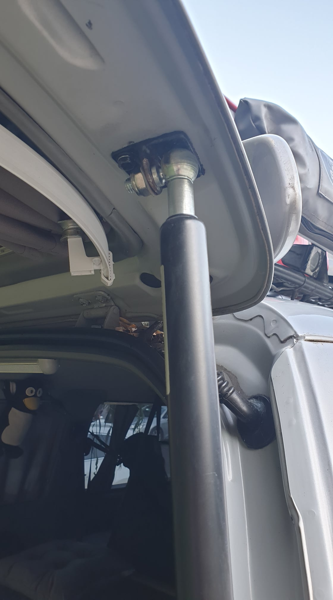  
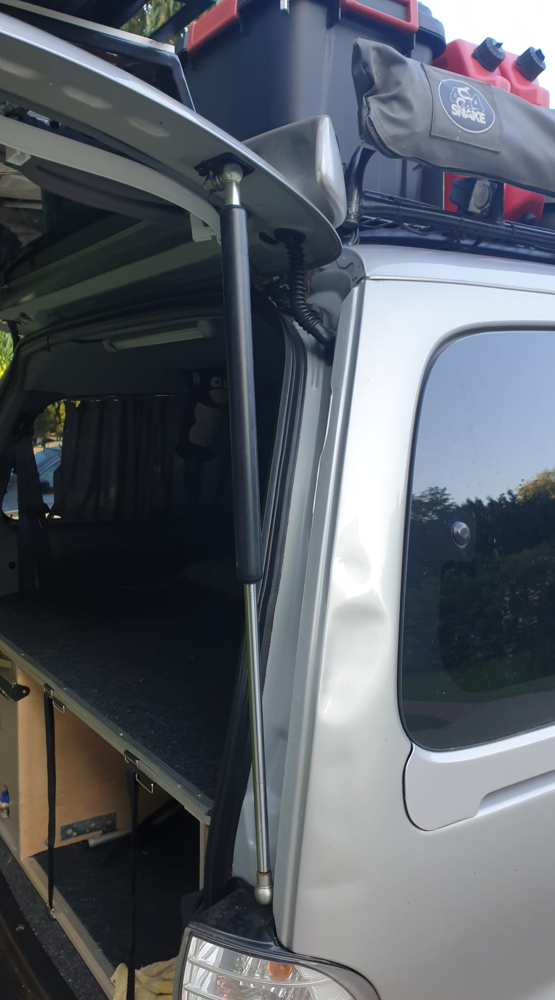  
*PL: Zmiana na mocowanie kulowe wyeliminowała niepotrzebne naprężenia.*   
*EN: Switching to ball joints eliminated unnecessary stress.* 

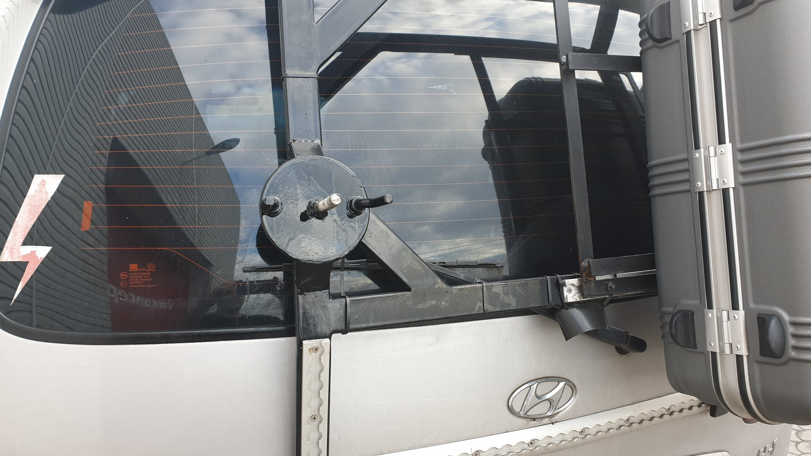  
*PL: Poprawiona piasta z dwiema szpilkami stabilizującymi pod felgę alu.*  
*EN: Improved hub with two alignment pins for alloy wheels.* 

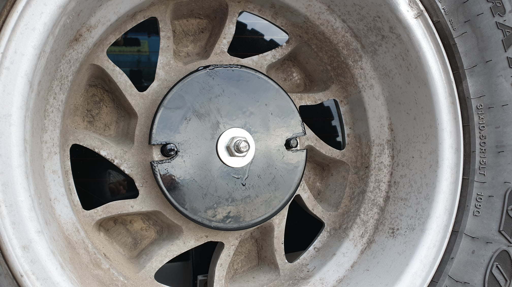  
*PL: Gotowy zestaw przed założeniem pokrowca.*   
*EN: Finished setup before installing the gear bag.* 

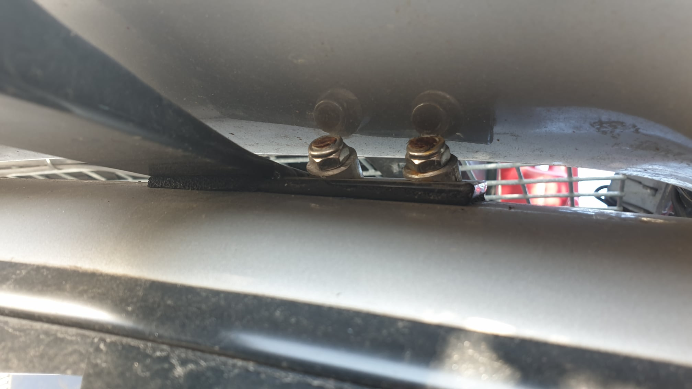  
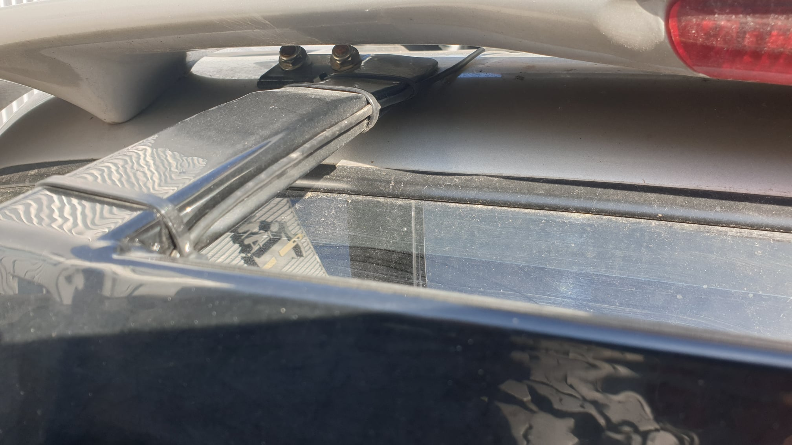  
*PL: Mocowanie stelaża do zewnętrznej części zawiasów.*   
*EN: Rack attachment to the outer part of the hinges.* 

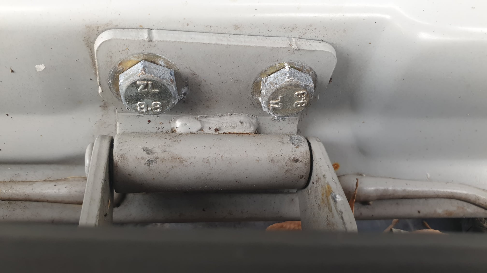  
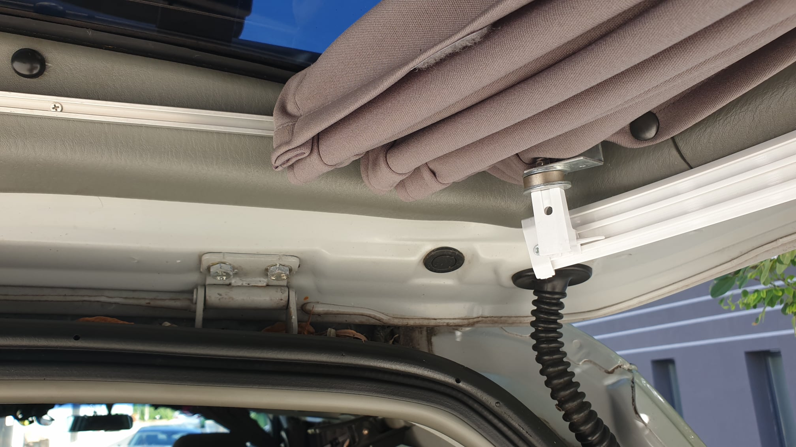  
*PL: Wzmocnienie mocowania od wewnętrznej strony klapy.*   
*EN: Mounting reinforcement on the inner side of the tailgate.* 

---
**Status:** Przetestowane. Klapa otwiera się i trzyma pewnie nawet z pełnym obciążeniem!
