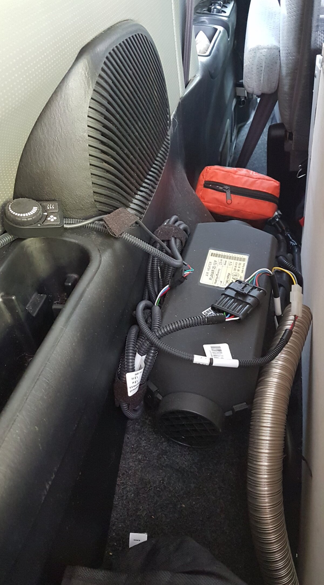
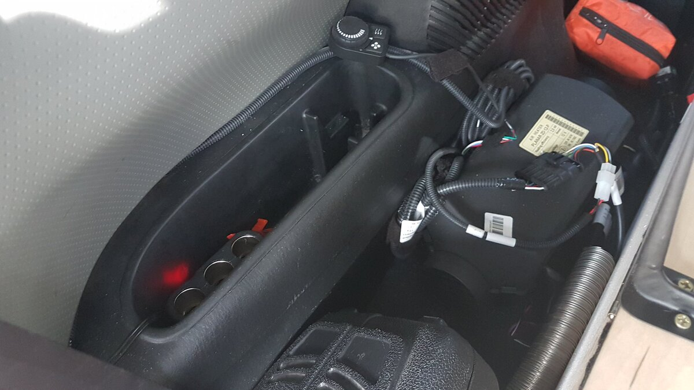
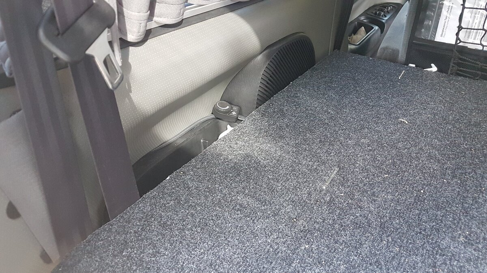
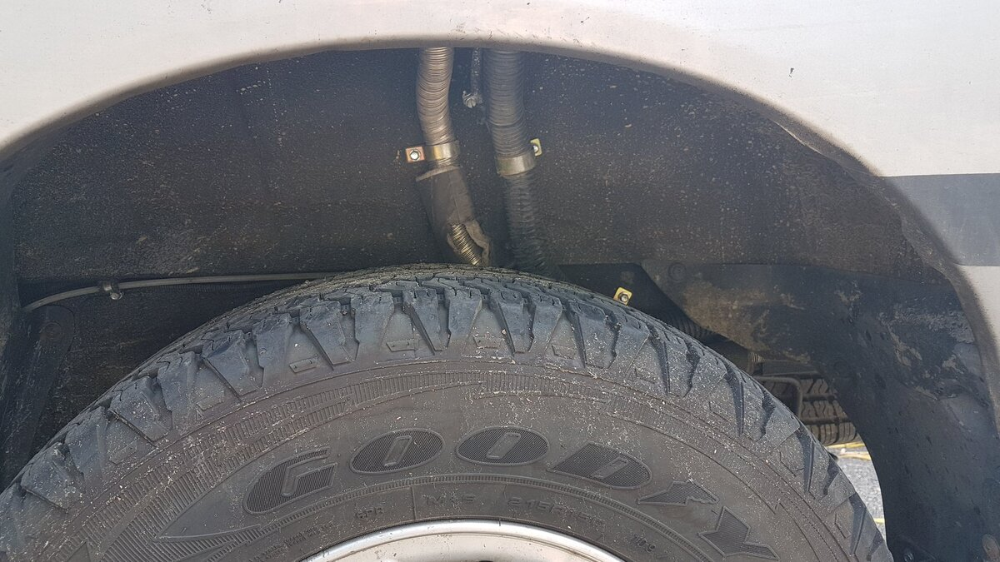
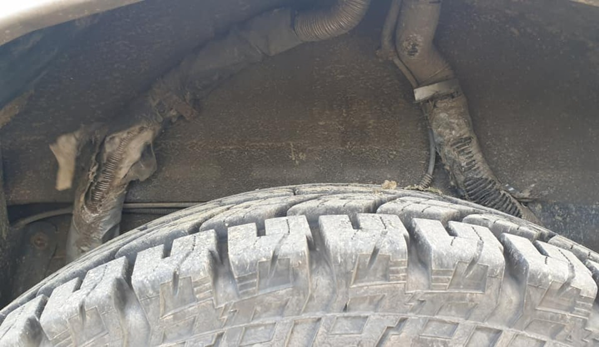
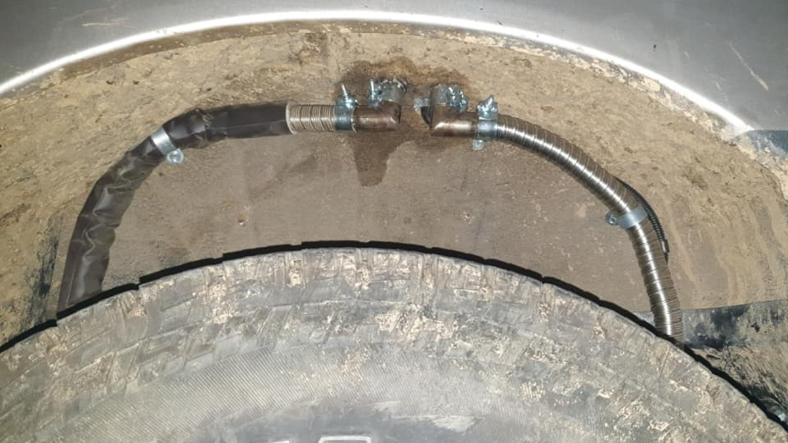
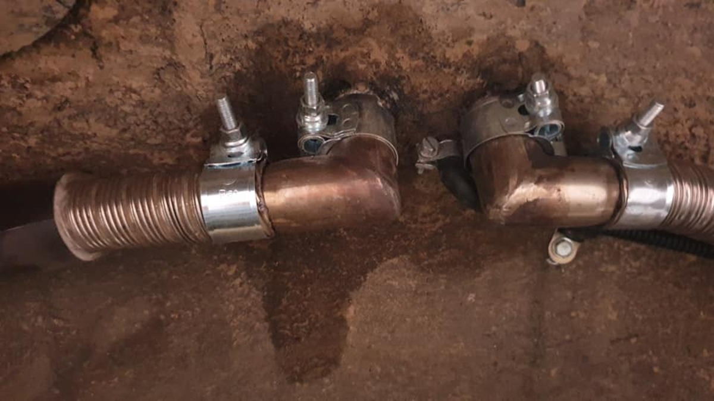

# Ogrzewanie postojowe Planar 2kW  
# Diesel Heater Planar 2kW (PL/EN)  

---

## [PL] Opis instalacji  
Moc 2kW jest w zupełności wystarczająca, aby ogrzać dużą kabinę Starexa nawet w mroźne noce.  
Urządzenie oferuje dwa główne tryby pracy:  

1. **Grzanie:** Możliwość ustawienia mocy (stały nadmuch) lub temperatury. W trybie temperatury Planar zwalnia obroty po jej osiągnięciu, a w razie potrzeby wyłącza się i startuje ponownie, gdy temp. spadnie.  
2. **Wentylacja:** Przydatna w upalne dni do wymuszenia obiegu powietrza w aucie.  

### Montaż i przemyślenia:  
Urządzenie zamontowane na lewym tylnym nadkolu, ukryte wewnątrz zabudowy pod uchylną klapką.  
Początkowe ułożenie rur pod spodem zostało zweryfikowane przez rumuńskie bezdroża i opony 31", co wymusiło poprawkę z użyciem sztywnych kolanek.  

---

## [EN] Installation Details  
The 2kW power output is more than enough to heat the large Starex cabin even during freezing nights.  
The device offers two main operating modes:  

1. **Heating:** Can operate by power level or target temperature. In temperature mode, the heater scales down once the target is met, eventually shutting off and restarting when the temp drops by a few degrees.  
2. **Ventilation:** Great for hot days to circulate fresh air inside the cabin.  

### Mounting and Lessons Learned:  
The unit is mounted on the left rear wheel arch, hidden inside the DIY furniture with a flip-up lid.  
The original routing of the external pipes was destroyed in Romania due to 31" tires rubbing. The fix involved using rigid elbows and metal intake pipes for better clearance.  

---

## 📸 Dokumentacja Foto / Photo Documentation  

  
*PL: Lewe nadkole. Powietrze zasysa od klapy, wypuszcza w stronę wnętrza.*  
*EN: Left wheel arch. Intake from the rear, hot air outlet facing the front.*   
*PL: Całość pod klapką. Obok mieści się kompresor i narzędzia.*  
*EN: Hidden under the lid. Next to it: compressor and tools.*   
*PL: Urządzenie schowane, na zewnątrz wystaje tylko panel sterowania.*  
*EN: Unit hidden, only the control panel remains accessible.*   
  
*PL: Oryginalne rury zmasakrowane przez opony 31" w Rumunii.*  
*EN: Original pipes destroyed by 31" tires during the Romania trip.*   
  
*PL: Poprawka: kolanka wzdłuż nadkola i wzmocniona rura zasysająca.*   
*EN: The fix: elbows along the wheel arch and a reinforced intake pipe.* ---
**Status:** Przetestowane w warunkach zimowych i offroadowych.
