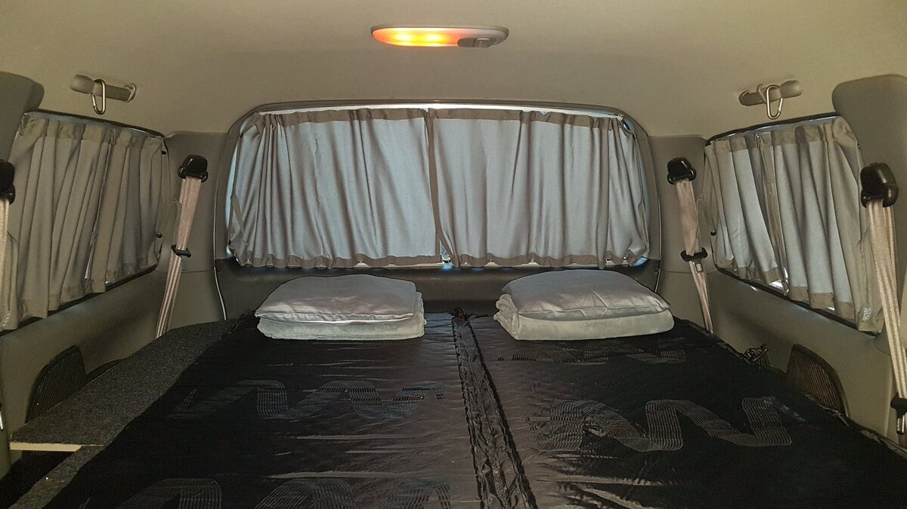
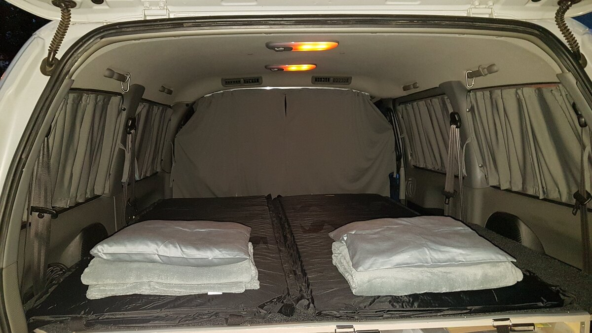
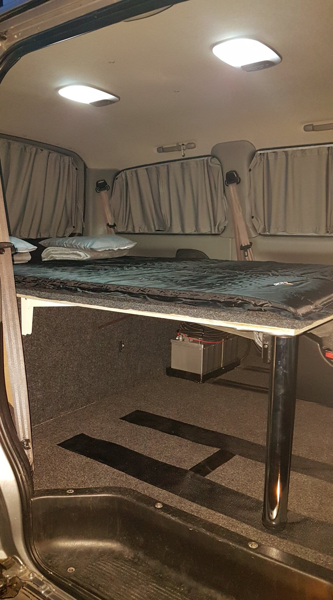

# Rozbudowa zabudowy: System zasłonek (Wersja 1.1)
# Camper Build Upgrade: Curtain System (Ver 1.1)

---

## [PL] Opis modyfikacji
Kolejny etap dopasowania Starexa do noclegów "na dziko". Aby zapewnić prywatność i komfort termiczny, zainstalowany został pełny system zasłonek.

### Główne cechy:
* **Montaż:** Zasłonki poruszają się na aluminiowych szynach przykręconych do elementów wnętrza, wpięte za pomocą dedykowanych haczyków.
* **Zasięg:** Osłonięte wszystkie boczne oraz tylne szyby.
* **Dodatkowa zasłonka:** Oddzielenie przedziału przednich foteli od części sypialnej oraz osłona drzwi bocznych (przesuwnych) – pozwala to na spanie przy otwartych drzwiach w upalne noce.
* **Pochodzenie:** Zestaw kupiony w `autozaslonki.com` (opcja dla ceniących czas), ale system jest prosty do odwzorowania we własnym zakresie (DIY).

---

## [EN] Modification Details
The next step in converting the Starex for off-grid camping. A full curtain system was installed for privacy and light control.

### Key features:
* **Mounting:** Curtains slide on aluminum rails screwed into the interior trim, attached with dedicated hooks.
* **Coverage:** All side and rear windows are covered.
* **Partition Curtain:** A separate curtain separates the front seats from the sleeping area and covers the sliding side door – allowing for sleep with the door open on hot nights.
* **Source:** Kit purchased from `autozaslonki.com` (time-saving option), but easily replicable as a DIY sewing project.

---

## 📸 Dokumentacja Foto / Photo Documentation

---
**Status:** Przetestowane w terenie. Zapewnia 100% prywatności.
