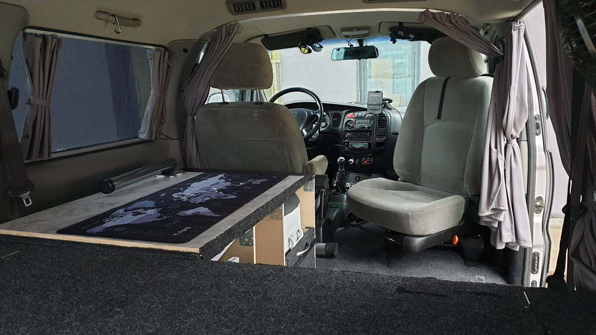
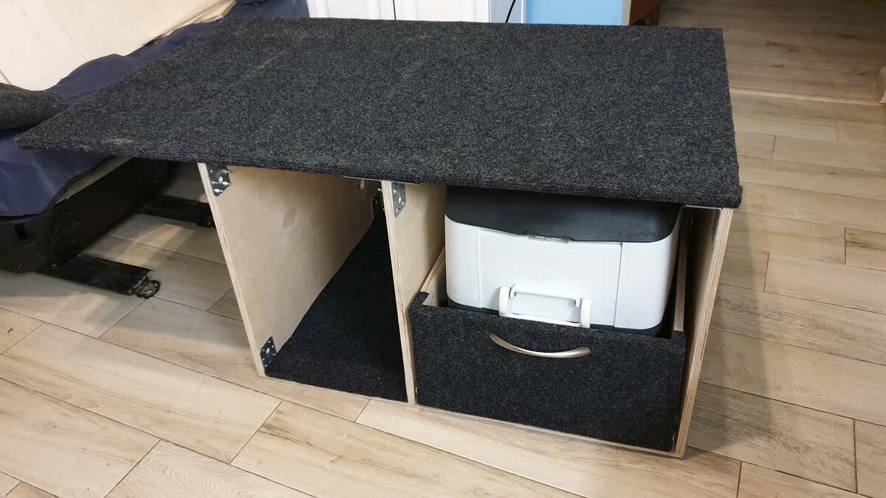
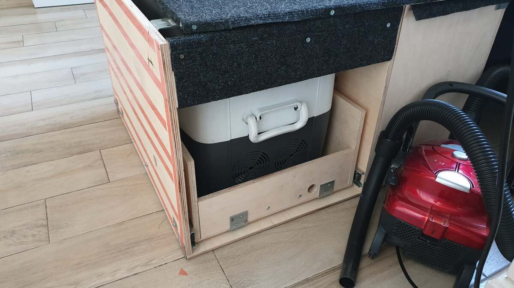
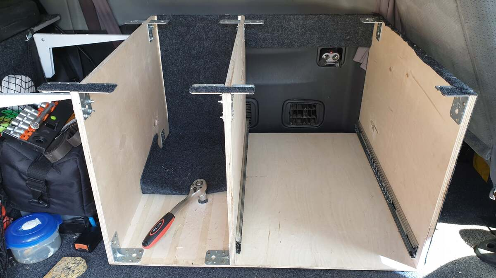
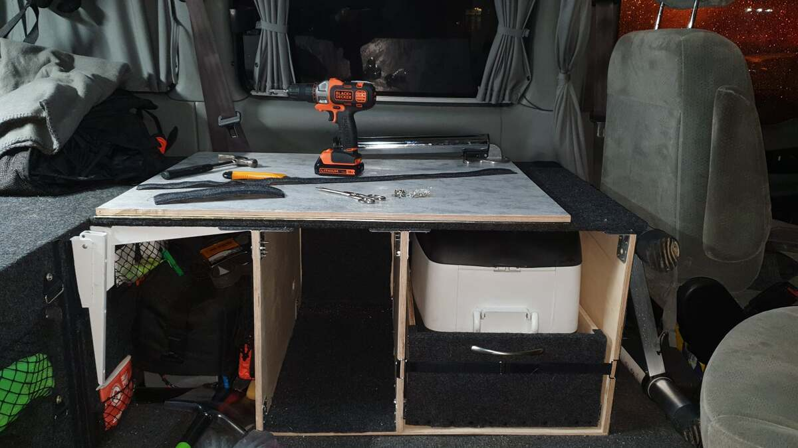
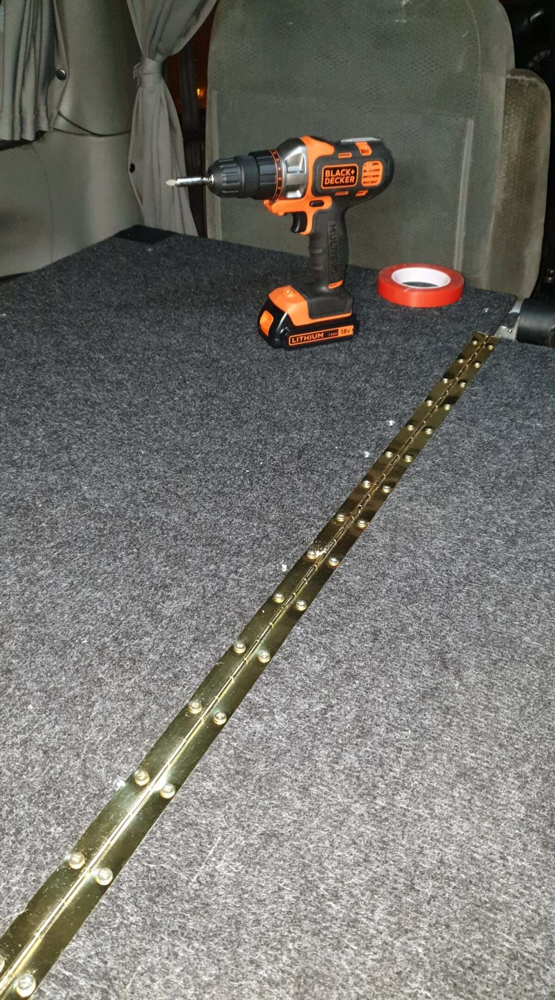
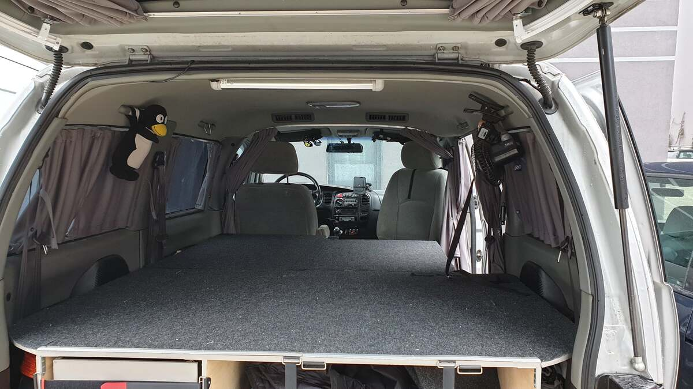
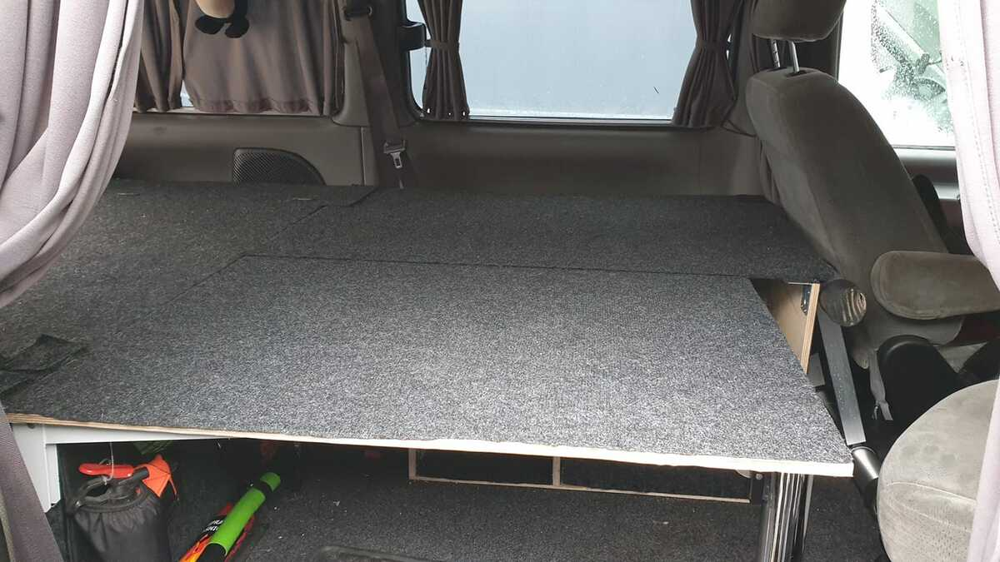
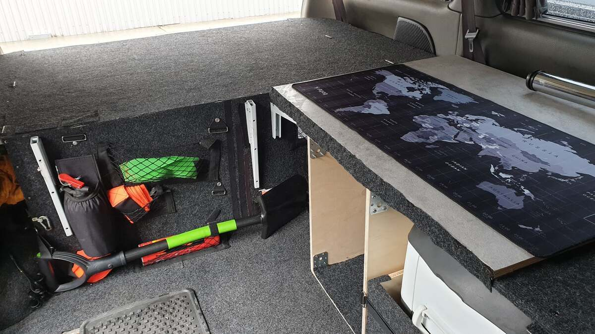
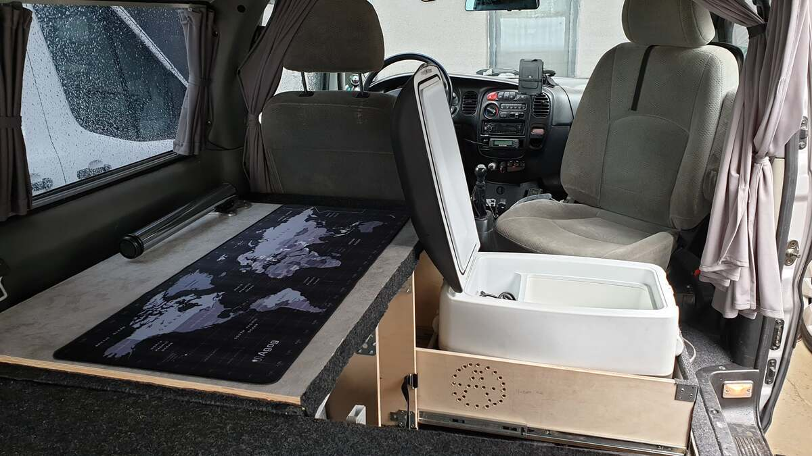

# Zabudowa wnętrza DIY v1.2 (Lodówka i spanie)  
# DIY Interior Build v1.2 (Fridge & Sleeping) - PL/EN  

---

## [PL] Opis modyfikacji  
Ewolucja zabudowy wyprawowej. Wersja 1.2 skupia się na ergonomii codziennego użytkowania i szybkim przygotowaniu miejsca do spania.  

### Główne zmiany:  
* **Konfiguracja:** Wyjęto jeden fotel z drugiego rzędu. Auto zarejestrowane na więcej osób, obecnie podróżuje w układzie 2 lub 3-osobowym, co dało ogromną przestrzeń transportową.  
* **Szuflada na lodówkę:** Nowy moduł z wysuwaną szufladą na lodówkę kompresorową oraz dodatkowy schowek na prowiant.  
* **System spania:** Rozkładany blat / łóżko. Największą zaletą jest brak konieczności przekładania elementów zabudowy z tyłu na noc – wszystko rozkłada się "wewnątrz".  
* **Miejsce dla psa:** Górna część dobudówki służy jako bezpieczne posłanie dla psa. Zwierzę jest przypięte atestowanym pasem, wkręconym w oryginalne punkty montażowe pasów bezpieczeństwa.  

---

## [EN] Modification Details  
Evolution of the expedition interior setup. Version 1.2 focuses on daily ergonomics and quick bed setup.  

### Key Changes:  
* **Configuration:** One second-row seat was removed. While the car can hold more, it currently travels in a 2 or 3-person layout, providing massive storage space.  
* **Fridge Slider:** New module featuring a heavy-duty drawer for a compressor fridge and an extra storage compartment for food.  
* **Sleeping System:** Fold-out platform/bed. The biggest advantage is that no rear components need to be moved to set up the bed at night – it all unfolds internally.  
* **Pet Safety:** The top of the module serves as a dedicated dog bed. The dog is secured with a safety leash bolted into the original seatbelt mounting points.  

---

## 📸 Dokumentacja Foto / Photo Documentation  

  
*PL: Ogólny widok na nowy moduł zabudowy.*   
*EN: General view of the new module.* 

  
  
  
*PL: Detale konstrukcyjne szuflady i schowka.*   
*EN: Construction details of the drawer and storage.* 

  
  
*PL: System wysuwu lodówki.*   
*EN: Fridge slide-out system.* 

  
  
*PL: Rozkładanie blatu do spania.*   
*EN: Unfolding the sleeping platform.* 

  
  
*PL: Miejsce dla psa z wpięciem w pasy.*   
*EN: Dog's spot with seatbelt attachment.* 

  
  
  
  
*PL: Efekt końcowy i wykorzystanie przestrzeni.*   
*EN: Final result and space utilization.* 

---
**Status:** Przetestowane. Komfort spania i dostęp do zimnego napoju/jedzenia na najwyższym poziomie!
